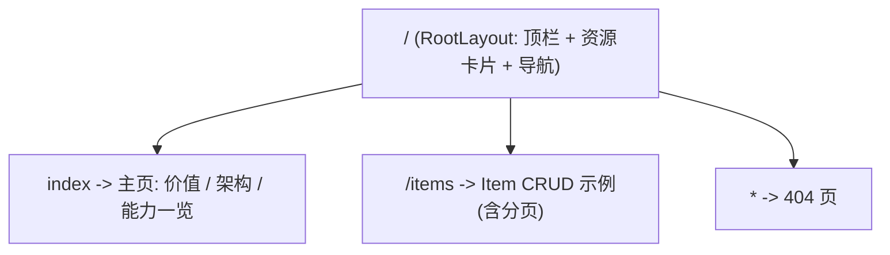

# 通用 monorepo 母版 · 架构方案

- 文档编号: 20260715_通用monorepo母版架构方案
- 定位: 交付给 PMO、测试等团队的全栈脚手架母版,各团队 fork 后自行迭代自己的工具与系统
- 状态: 已落地,持续演进
- 说明: **本文件是母版架构的单一事实源** —— 设计、决策(ADR)、基座能力都并在这里,改母版前先看这里,别无谓推翻已定权衡;新增重大决策往"三、决策记录"追加一行。

---

## 一、背景与目标

各团队(PMO、测试等)需要快速搭建自己的内部工具与系统,但每个团队从零起步会重复踩坑,且质量参差。
本方案提供一套**极简、可 fork 的全栈 monorepo 母版**,让团队 clone 即用、照葫芦画瓢加功能。

母版保证三件事:

1. **能跑通** —— 一个端到端 CRUD 闭环打样, 前后端链路现成。
2. **写不进烂代码** —— 一套质量基座(后端 Ruff + mypy + pytest / 前端 Biome + tsc + Vitest), 一键 `pnpm check` 自查。
3. **地基齐全** —— 任何 web 业务几乎必用的能力(路由、分页、定时任务、生产日志、配置服务)开箱即用(见"九、基座能力")。

### 核心痛点与对策

Python 没有编译期, 类型错误、拼写错误只能等运行到那一行才暴露, 风险大。
对策: 用 `Ruff + mypy + pytest/TDD` 三道防线组成"编译期替身"。现阶段靠一键 `pnpm check` 手动自查(不给非工程团队添负担); 工程成熟后再上 `pre-commit + CI` 双卡强制(见附录 A)。

---

## 二、定位与非目标(YAGNI 边界)

### 母版做什么

- 极简种子: 一个通用示例实体(Item)的端到端 CRUD 闭环(含分页)。
- 完整质量基座: 后端 Ruff + mypy + pytest / 前端 Biome + tsc + Vitest, 一键 `pnpm check` 自查。
- 常用地基: 前端路由 + SPA 深链兜底、进程内定时任务、列表分页、生产级日志、配置服务(见"九")。
- 傻瓜启动: `pnpm dev`(自动探测端口)或 run.sh / run.bat 起开发; 生产 `pnpm build` + `pnpm start` 同源单进程。

### 母版不做什么(有意不做, 交给各团队按需自加)

鉴权 / 登录 / 权限(仅 `core/security.py` 占位)、部署 / Docker / 生产可观测、CI / pre-commit 硬闸门(文档化为未来, 见附录 A)、任务队列(Celery / RQ)、多租户 / 软删 / 审计字段、配置中心的具体客户端 / watcher、YAML 声明式配置、任何具体业务横切逻辑。

理由: 母版越薄越通用, 越厚越绑死业务假设。预置这些等于替所有团队做了他们各自不同的选择。上面每一项都在对应位置留了 seam(接入点), 需要时按 seam 接, 不预置。

---

## 三、决策记录(ADR)

母版里"为什么这么选"的速查表 —— 一处 grep 到底。改动母版前先看这里, 新增重大决策往下追加一行。

| # | 决策点 | 选择 | 为什么 | 取舍 / 边界 |
|---|--------|------|--------|-------------|
| 1 | 母版厚度 | 极简种子 + 完整质量基座 + 常用地基 | 能跑通 + 写不进烂代码 + 地基齐全 | 不预置鉴权 / 部署 / 业务横切(见"二") |
| 2 | HTTP 方法 | 只用 GET / POST | 心智极简, 非专家团队够用 | 更新走 `POST /{id}/update`、删除走 `POST /{id}/delete`, 不用 PATCH/PUT/DELETE |
| 3 | API 版本化 | `api/v1` 前缀 | 方便后续平滑升级 | — |
| 4 | 后端分层 | 完整三层 route→service→repository | 职责清晰、可测、可扩展; 依赖链 `session→repository→service→route` 在 `deps.py` 装配 | 无数据访问的端点(如系统指标)可退化为 route→service |
| 5 | DTO 风格 | SQLModel 全家桶(Base/Table/Create/Update/Public) | 表结构与 API 契约解耦, 不额外分离纯 Pydantic | 每实体多个类, 用 Base 抽公共字段减重复 |
| 6 | 列表返回 | 分页信封 `Page[T]`(`GET ?limit&offset`) | 真实业务列表必分页; 仍只用 GET | 破坏性契约(数组→信封), 前后端须同步 |
| 7 | 定时任务 | 进程内 APScheduler, 随 lifespan 起停 | 与"单进程同源、无 nginx"一致, 零额外基建 | 多副本会重复触发; 上多副本需外部调度 / 分布式锁(不预置) |
| 8 | 定时任务访问数据 | job 经 `session_scope()` + service | 请求作用域外也守三层, 禁 job 内裸 SQL | — |
| 9 | 前端路由 | react-router 声明式(library 模式) | 多页是"任何形态"的地基; 不上 framework / Remix 模式 | — |
| 10 | SPA 深链兜底 | 后端 `SpaStaticFiles`(404→index.html) | 同源单进程下深链刷新不 404; 比 catch-all 干净(StaticFiles 挂 `/` 时 catch-all 不命中) | 不存在的 `/assets/*` 也回 index.html(SPA 常见, 可接受) |
| 11 | 日志出口 | structlog 双出口: 控制台人读 + 文件 JSONL | 生产要机读结构化 + 人读; UTC / 固定字段 `timestamp·level·logger·message` / 结构化异常 | — |
| 12 | 日志滚动 / 留存 | 8 小时滚动、留 30 份(= 10 天)自动清理 | 覆盖 10 天窗口并自动清过期 | 由 `APP_LOGGING__*` 环境变量覆盖 |
| 13 | 配置来源 | pydantic-settings 纯 env / .env(12-factor) | Python 最主流; 各环境差异靠 env, 不建每环境文件; 便于 ConfigMap / Nacos 注入 | 放弃 YAML 声明式(曾评估 Spring 风格, 最终取 12-factor) |
| 14 | 配置热更 | `reload_settings()` seam | 预留配置中心 watcher 的接入点 | 只留 seam, 不预置具体客户端(YAGNI) |
| 15 | .env 是否入库 | **提交** `apps/back/.env`(仅无密钥默认值) | 母版给非专家: 隐藏文件 + 让人 `cp` 他们不会; 可见可改、开箱即用 | 标准做法是忽略 .env; 此为**母版特例**, .gitignore 开负例, **严禁写入真实密钥**(密钥走环境变量) |
| 16 | SQL 日志 | 统一由 `core/logging` 控制(不用引擎 echo) | 避免引擎 echo 与 root handler 双写 | `APP_LOGGING__SQL_ECHO`(默认 true, 生产建议 false) |
| 17 | 类型检查器 | mypy(strict)作主闸门 | 从严起步, 团队按需局部放宽 | ty 留作本地可选加速, 不强制 |
| 18 | 前端 lint/format | Biome(单二进制) | 与 Ruff 理念一致, 快、零配置友好 | — |
| 19 | 前端类型客户端 | openapi-typescript 仅可选提效 | 不绑死: 团队可手写 fetch | 不进硬闸门 |
| 20 | 预置常用包 | httpx / orjson / structlog / tenacity / python-multipart / email-validator / pandas / openpyxl / apscheduler | 覆盖多数内部工具的取数、序列化、日志、重试、导入导出、调度 | 前端 react-router-dom |
| 21 | 质量闸门 | Ruff + mypy(strict) + pytest / Biome + tsc + Vitest, 一键 `pnpm check` | Python 无编译期, 三闸门当"编译期替身"; 覆盖率 ≥ 80% | 手动一键、不拦提交; pre-commit / CI 留未来(附录 A) |
| 22 | 本地端口 | 顶层 `ports.json` 候选(后端 8901-8903 / 前端 8911-8913) | `pnpm dev` 探测空闲端口, 全占用报错; 选不常见端口降冲突 | — |
| 23 | 部署形态 | 同源单进程(`pnpm build` + `pnpm start`) | 无 nginx / 反代 / 跨域 / 多进程编排, 一台机一个端口上线 | SQLite 单写、生产单 worker; 要横向扩并发换 Postgres |
| 24 | Agent 团队 | 5 个项目级 subagent(单会话内流水线)+ `memory: project` | 最简 Agent 团队形态, 零额外基建; 越用越懂本项目 | 记忆需认真裁剪 `MEMORY.md` 并提交共享 |

---

## 四、技术栈总览

| 层 | 选型 |
|----|------|
| Monorepo | pnpm workspace + uv; 根级 dev / build / start / check 脚本 |
| 后端 | FastAPI + SQLModel + SQLite(WAL) + Alembic + uv |
| 后端质量 | Ruff(lint+format) + mypy(strict) + pytest + coverage |
| 定时任务 | APScheduler(AsyncIOScheduler, 进程内) |
| 日志 | structlog + stdlib logging 双出口(控制台人读 / 文件 JSONL) |
| 配置 | pydantic-settings(env + .env, 12-factor) |
| 前端 | Vite + React + TypeScript(strict) + react-router-dom + Zustand + React Query + ECharts |
| 前端质量 | Biome(lint+format) + TS 编译期 + Vitest |
| 前端 API 客户端 | openapi-typescript(可选生成, 不强制) |
| 质量自查 | `pnpm check`(手动一键); pre-commit + CI 为未来可选(附录 A) |
| 本地端口 | 顶层 `ports.json` + `scripts/dev.mjs` 探测(冲突自动跳, 全占用报错) |

---

## 五、目录结构

```
my-app-monorepo/
├── apps/
│   ├── back/                       # Python 后端
│   │   ├── app/
│   │   │   ├── api/
│   │   │   │   ├── deps.py         # 依赖注入装配: session -> repository -> service
│   │   │   │   └── v1/             # 版本化路由(薄控制器): items / health / system
│   │   │   ├── services/           # 服务层: 业务逻辑编排(不碰 session/SQL)
│   │   │   ├── repositories/       # 仓储层(DAO): 数据访问, 持 session 写 SQLModel 查询
│   │   │   ├── models/             # SQLModel 全家桶(Table + 契约)+ 通用 Page[T] 分页信封
│   │   │   ├── db/                 # session(引擎/会话/session_scope) + base(模型汇总)
│   │   │   ├── core/               # config(配置服务) / logging(双出口) / scheduler(定时任务) / time / exceptions / security 占位
│   │   │   ├── main.py             # FastAPI 入口 + 定时任务起停 + 前端静态托管(SpaStaticFiles 兜底)
│   │   │   └── tests/              # pytest(内存 SQLite), TDD 主战场
│   │   ├── migrations/             # Alembic(异步 env)
│   │   ├── .env                    # 母版默认配置(随仓库提交, 仅无密钥默认值)
│   │   └── pyproject.toml          # 集中 Ruff + mypy + pytest + coverage 配置
│   └── web/                        # React 前端
│       ├── src/
│       │   ├── api/                # 轻量客户端(可选 openapi 生成), Page<T> 分页类型
│       │   ├── layouts/            # RootLayout: 顶栏 + 资源卡片 + 导航 + <Outlet/>
│       │   ├── pages/              # HomePage / ItemsPage / NotFoundPage
│       │   ├── components/         # 展示组件(分页控件、能力卡片等)
│       │   ├── hooks/              # useItems 等: UI 与数据逻辑分离
│       │   └── stores/             # Zustand 全局 UI 状态
│       ├── tests/                  # Vitest
│       ├── biome.json / tsconfig.json / vite.config.ts / package.json
├── ports.json                      # 顶层端口候选(后端 8901-8903 / 前端 8911-8913)
├── scripts/                        # dev.mjs(开发编排 + 端口探测) / start.mjs(生产启动)
├── check.sh / check.bat            # 一键质量自查(不拦提交, 双击即可)
├── docs/                           # 方案文档(本文件为单一事实源)
├── pnpm-workspace.yaml
├── package.json                    # dev / build / start / check 脚本
├── run.sh  /  run.bat              # 傻瓜一键起开发
└── README.md                       # 母版说明 + fork 上手
```

分层职责(完整三层):

| Java 分层 | 母版对应 | 职责 |
|-----------|----------|------|
| Controller | `app/api/v1/*.py` | 只收参、调 service、返 DTO。不写业务、不碰 SQL |
| Service | `app/services/*.py` | 业务逻辑编排 + 抛业务异常。调 repository, 不碰 session/SQL |
| Repository/DAO | `app/repositories/*.py` | 数据访问: 持 session, 用 SQLModel 写查询(add/get/list/count/delete) |
| Entity/DTO | `app/models/*.py` | SQLModel: Table + Create/Update/Public; 通用 `Page[T]` 分页信封 |
| 统一异常 | `app/core/exceptions.py` | 业务异常 -> HTTP 状态码全局映射 |

依赖链靠 FastAPI `Depends` 自动装配:`session -> repository -> service -> route`(装配代码在 `app/api/deps.py`)。

### 数据访问层(ORM / SQL 怎么操作,对照 Java mapper)

"mapper" 在 Java 有两个含义,在母版里分别落在两个位置:

1. **O/R 映射(表 ↔ 对象)= JPA `@Entity` / Hibernate 映射** → `app/models/item.py`。
   `Item(table=True)` 类本身就是映射,`Field(primary_key=/index=...)` 就是列/主键/索引映射。SQLModel 底层是 SQLAlchemy ORM。

2. **SQL / 数据访问操作 = MyBatis Mapper / JPA Repository** → `app/repositories/item_repository.py`。
   用 SQLModel 的 `select()` + `AsyncSession` 的 `get/add/flush/delete/exec` 表达,都是"用 Python 写的、类型安全的 SQL"。

仓储层实际操作:

```python
# INSERT
self._session.add(item); await self._session.flush(); await self._session.refresh(item)
# SELECT ... WHERE id = ?
await self._session.get(Item, item_id)
# SELECT * FROM item ORDER BY id LIMIT ? OFFSET ?
result = await self._session.exec(select(Item).order_by(col(Item.id)).limit(limit).offset(offset)); return result.all()
# SELECT count(*) FROM item
result = await self._session.exec(select(func.count()).select_from(Item)); return int(result.one())
# DELETE FROM item WHERE ...
await self._session.delete(item); await self._session.flush()
```

对照表:

| Java(MyBatis / JPA) | 母版 | 位置 |
|----|----|----|
| `@Entity` / `@Column` 映射 | `Item(table=True)` + `Field(...)` | `models/item.py` |
| Mapper.xml 的 SQL / `@Query` | `select(Item)...` 表达式 | `repositories/*.py` |
| Mapper 接口 / Repository 方法 | `ItemRepository.add/get/list/count/delete` | `repositories/item_repository.py` |
| `SqlSession` / `EntityManager` | `AsyncSession` | `db/session.py` |
| `@Transactional` | `get_session` 请求级 UoW / `session_scope()` 请求外 UoW | `db/session.py` |

约定:

- 需要原生 SQL 时:`await session.exec(text("select ..."))`。
- 事务边界统一在 `get_session`:仓储只 `flush` 不 `commit`,请求成功由 session 依赖统一 commit。请求作用域之外(如定时任务)用 `session_scope()` 自建同样的 UoW(见 9.2)。
- **SQL 日志默认打印**(`APP_LOGGING__SQL_ECHO=true`),由 `core/logging.py` 统一控制(不用引擎 echo,避免日志双写);生产设 `false`。

---

## 六、Python 质量基座(方案灵魂: 编译期替身)

三道防线, 一个都不能少:

```
第 1 道  Ruff        风格 + lint + format(替代 flake8/isort/black), 秒级
第 2 道  mypy        类型检查, 跨函数/模块推断 —— 这就是"编译期替身"
第 3 道  pytest+TDD  Red -> Green -> Refactor, 覆盖率闸门兜住行为正确性
```

### 质量闸门: 分阶段启用(不给非工程团队添负担)

母版使用者(PMO、测试)技术门槛不一, 强制拦截提交反而是负担甚至劝退。因此闸门分两阶段:

- **阶段一 · 现在(手动自查)**: 想查就跑 `pnpm check`(或双击 `check.bat`), 一把跑完前后端全部检查。不拦提交、零学习成本。
- **阶段二 · 工程成熟后(强制拦截)**: 团队协作变多、回归风险上升时, 再启用 pre-commit(本地拦提交) + CI(拦合并)双卡硬闸门。配置见**附录 A**, 到时照抄即可。

`pnpm check` = 后端 `Ruff + mypy + pytest` + 前端 `Biome + tsc + Vitest`, 与将来 CI 跑的完全一致, 只是现在靠自觉、将来靠强制。

### 配置基调

- mypy `strict` 起步: 母版从严, 团队按需**局部**放宽, 而不是反过来。
- 覆盖率: 后端 `line coverage >= 80%`, `core/` 等共享模块更高; 前端起步不设硬阈值(痛点不在此)。

### 已知技术张力: SQLModel + mypy strict

SQLModel 底层是 SQLAlchemy + Pydantic, 在 mypy strict 下历史上有摩擦。母版处理方式:

1. 启用 Pydantic 官方 mypy plugin。
2. 对确有摩擦的边界, 用最小化 `# type: ignore[code]` 精确豁免(禁止整文件关闭检查)。
3. 缺类型存根的第三方(psutil / openpyxl / apscheduler)在 `pyproject.toml` 用 `[[tool.mypy.overrides]]` 精确 `ignore_missing_imports`。
4. 若团队对类型严格度要求更高, 备选: SQLAlchemy 2.0 `Mapped[...]` + Pydantic DTO 分离(类型更干净, 但更啰嗦)。母版默认保留 SQLModel。

---

## 七、前端约定(轻约束, 给快速开发让路)

- TypeScript `strict: true` —— 前端有编译期, 天然兜底, 不再叠加独立类型检查器; 禁 `any`。
- lint/format: **Biome**(单二进制, 快, 零配置友好)。
- 路由: **react-router-dom** 声明式(library 模式), UI 与数据逻辑分离(页面组件 + `hooks/`)。
- `openapi-typescript`: 配好生成脚本, 但**不进硬闸门**, 用不用随意。
- 测试: Vitest, 纳入 `pnpm check`, 阈值比后端宽松。

---

## 八、端到端 CRUD 闭环打样

种子放一个通用示例实体 `Item`, 打通整条链路给团队照葫芦画瓢:

```
前端页面(react-router) -> hooks(React Query) -> 客户端(或手写 fetch)
   -> FastAPI 路由(GET ?limit&offset 分页) -> SQLModel 校验
   -> service.list_page -> repository.list + count
   -> SQLite(WAL) 落库 -> Page[ItemPublic] 回显(可挂 ECharts)
```

该示例同时是"如何按母版规范写一个功能 + 配套测试"的活样板。

---

## 九、基座能力(开箱即用)

以下五项是"任何 web 业务几乎必用"的地基, 母版已按硬约束(只用 GET/POST、完整三层、同源单进程、质量三闸门)落地, 团队照抄扩展即可。每项都给了扩展的 seam, 不预置具体业务。

### 9.1 前端路由 + SPA 深链兜底

`react-router-dom` 声明式(library 模式): `BrowserRouter` + `Routes/Route`。路由表:



**同源单进程的深链兜底(最容易踩的坑)**: 生产由 uvicorn 托管 `static/`。客户端路由下, 用户在 `/items` **刷新**会直接打后端, 无兜底就 404。母版用 `SpaStaticFiles`(继承 `StaticFiles`, 覆写 `get_response`)解决 —— 找不到文件(404)时回 `index.html`, 交给前端路由接管:

```python
# main.py: StaticFiles 挂在 "/" 上, API 路由先匹配, 其余落到这里
class SpaStaticFiles(StaticFiles):
    async def get_response(self, path: str, scope: Scope) -> Response:
        try:
            return await super().get_response(path, scope)
        except StarletteHTTPException as exc:
            if exc.status_code == 404:
                return await super().get_response("index.html", scope)
            raise
```

比"再加一个 `@app.get('/{full_path:path}')` catch-all"干净: `StaticFiles` 挂在 `/` 时 catch-all 根本不命中, 兜底逻辑内聚在静态托管里。开发态(vite)自带 SPA fallback, 无需改。

### 9.2 进程内定时任务

`APScheduler` 的 `AsyncIOScheduler`(async 原生, 复用 FastAPI 事件循环, 零额外进程), 随 lifespan 起停:

```mermaid
sequenceDiagram
  participant U as uvicorn
  participant L as lifespan
  participant S as AsyncIOScheduler
  participant J as demo job
  U->>L: startup
  L->>L: create_all(建表)
  L->>S: register_jobs(); scheduler.start()
  S-->>J: 按触发器周期调度
  U->>L: shutdown
  L->>S: scheduler.shutdown(wait=False)
```

**层次纪律(核心设计点)**: job 运行在请求作用域之外, 拿不到 `Depends(get_session)`, 但**禁止**在 job 里直接写 SQL —— 必须经 service。做法: `db/session.py` 抽一个独立 UoW 上下文 `session_scope()`(与 `get_session` 共用同一 engine / session factory), 让 job 自建 session 再走 service:

```python
# core/scheduler.py: demo job 经 service.count, 不碰 SQL
async def log_item_count() -> None:
    async with session_scope() as session:
        service = ItemService(ItemRepository(session))
        total = await service.count()
    logger.info("scheduled.item_count", total=total)

def register_jobs() -> None:  # 团队新增 job 在此 add_job
    scheduler.add_job(log_item_count, "interval", seconds=60, id="log_item_count",
                      replace_existing=True, max_instances=1, coalesce=True)
```

**多实例重复触发(边界)**: in-process 调度在每个进程 / worker 各跑一份。母版是单 worker(`start.mjs` 未开 `--workers`), 当前无碍。上多副本时二选一 —— APScheduler 配持久 jobstore + 分布式锁, 或改用外部调度器(系统 cron / K8s CronJob 打一个内部 GET)。母版不预置(YAGNI), 仅备注。

### 9.3 列表分页(通用 Page[T] 信封)

真实业务列表必分页。`GET /items` 返回**分页信封**而非裸数组, 三层贯通, 仍只用 GET:

```
GET /api/v1/items?limit=20&offset=0
-> { "items": [ItemPublic...], "total": 128, "limit": 20, "offset": 0 }
```

- 通用信封 `models/pagination.py`(PEP 695 泛型, 团队新实体照抄 `response_model=Page[XxxPublic]`):

```python
class Page[T](BaseModel):
    items: list[T]
    total: int   # 满足条件的总条数(与分页无关)
    limit: int
    offset: int
```

- `repository`: `list(limit, offset)` 加 `.limit().offset()`; 新增 `count()`(`select(func.count()).select_from(Item)`)。
- `service`: `list_page(limit, offset) -> Page[Item]`(取 items + total)。
- `route`: `list_items(limit=Query(20, ge=1, le=100), offset=Query(0, ge=0))`, `response_model=Page[ItemPublic]`。
- 前端: `api/client.ts` 用 `Page<T>`; `hooks/useItems` 用 `placeholderData: keepPreviousData` 避免翻页闪烁; `ItemsPage` 底部翻页 + `total` 计数。

**破坏性契约(边界)**: `list` 从数组变信封, 前后端必须成对改, 否则前端白屏。

### 9.4 生产级日志(structlog 双出口)

`structlog` + stdlib `logging` 双出口, 格式 / 滚动 / 留存全由配置的 `logging` 段控制(见 9.5), 不写死在代码:

- **控制台**: 人类可读(带颜色, 非 TTY 自动关色), 供开发 / 运维直接看。
- **文件**: **JSONL**, 字段固定且可预期 —— `timestamp`(UTC ISO8601 带 Z)、`level`、`logger`、`message`(事件正文, 聚合生态标准键), 其余为结构化上下文; 异常走 `exception` 结构化 traceback(非字符串)。
- **滚动 / 留存**: `TimedRotatingFileHandler`, 默认每 8 小时滚动、保留 30 份(= 10 天), 超出自动删除(过期自清)。
- 第三方(sqlalchemy / uvicorn)的 stdlib 日志经 `foreign_pre_chain` 归一到同一套字段与两个出口; SQL 回显靠调 `sqlalchemy.engine` 的级别(不用引擎 echo, 避免双写)。

一行 JSONL 样例:

```json
{"timestamp":"2026-07-19T03:24:40.315901Z","level":"info","logger":"app.core.scheduler","message":"scheduled.item_count","total":0}
```

### 9.5 配置服务(纯 env, 预留配置中心)

后端有一个明确的**配置服务**概念(`core/config.py`), 为未来接入 Nacos / Eureka / K8s ConfigMap 等配置中心的自动更新能力预留接口:

- **来源与优先级**: `pydantic-settings` 的 `BaseSettings`, 优先级 `环境变量 > .env > 代码默认`。纯 12-factor —— 各环境差异用**环境变量**表达, 不为每个环境建配置文件。ConfigMap / Nacos 把配置挂成 env 注入即可。
- **前缀与嵌套**: 全部 `APP_` 前缀; 嵌套键用双下划线, 例 `APP_LOGGING__LEVEL=DEBUG`、`APP_LOGGING__SQL_ECHO=false`。
- **热更 seam**: `reload_settings()` 从环境重新加载并**原地更新单例**(既有 `from ... import settings` 引用也能读到新值)。未来接配置中心的变更 watcher 时, 由其在配置变更回调里调它; 有副作用的组件(如日志级别)由调用方拿到新配置后自行重新 `configure_logging`。母版只留这个 seam, **不预置任何配置中心客户端 / watcher**(YAGNI)。
- **.env 入库(母版特例)**: 标准做法是 `.gitignore` 忽略 `.env`。但母版面向非专家, "隐藏文件 + 让人 `cp .env.example .env`"他们不会做。因此**提交** `apps/back/.env`(`.gitignore` 开负例 `!apps/back/.env`), 开箱即用、可见可改。**安全红线**: 该文件只放"无密钥的默认值", 真实密钥 / 生产专属值一律走环境变量注入, **禁止写进这个已提交的 .env**。

---

## 十、团队怎么用(fork 上手路径)

```
fork/clone
   -> 改项目名
   -> run.sh / run.bat 一键起
   -> 照 Item 示例加自己的模块(含分页照抄 Page[T])
   -> 写测试(TDD)
   -> 跑 pnpm check 自查(或双击 check.bat)
   -> 全绿后提交 / 合并
```

README 提供"5 分钟上手 + 加一个新功能的标准动作"清单。

---

## 十一、本地端口与启动 / 部署

### 端口(避免本地冲突)

- 顶层 `ports.json` 定义候选端口: 后端 `[8901, 8902, 8903]`、前端 `[8911, 8912, 8913]`(选不常见端口降低冲突)。
- `pnpm dev`(即 `scripts/dev.mjs`)启动时按顺序**探测第一个空闲端口**; 某端口被占则自动跳下一个; **全部被占用则报错退出**。
- 前端 `vite.config.ts` 从 dev 脚本注入的 env 取端口, 并把 `/api` 代理指向后端**实际**端口; 单独起前端时回退 `ports.json` 首个候选。

### 开发 vs 生产

| | 开发(`pnpm dev`) | 生产(`pnpm build` + `pnpm start`) |
|--|--|--|
| 进程 | 后端 uvicorn(--reload)+ 前端 vite(热更新)两个进程 | 后端 uvicorn 单进程 |
| 前端 | vite dev server, `/api` 代理到后端 | 已 build 成静态文件, 由后端 `SpaStaticFiles` 同源托管(含深链兜底) |
| 端口 | ports.json 探测 | `PORT` 环境变量或 `ports.json` backend[0], 固定不探测 |

生产是**同源单进程**: 一个 uvicorn 同时提供 `/api/v1/*`(API)与 `/`(前端页面)。`main.py` 的 `_mount_static` 在 `apps/back/static` 存在时挂载 `SpaStaticFiles`, 一并托管前端并兜底深链。

---

## 十二、交付物与后续

- 本方案文档(本文件, 单一事实源)+ 上手 `README.md`。
- 骨架代码: 可跑的 Item 闭环(三层 + 分页)+ 基座能力(路由 / 定时 / 日志 / 配置)+ 一键质量自查(`pnpm check`)+ 端口探测 + 生产同源托管。
- 后续: 各团队基于母版自行迭代; 工程成熟后按附录 A 启用 pre-commit + CI。

---

## 附录 A · 未来启用硬闸门的配置(照抄即可)

工程成熟(多人协作、回归风险上升)后, 把下面两份配置加回仓库, 即从"手动自查"升级为"双卡强制"。二者跑的检查与 `pnpm check` 完全一致。

### A.1 本地闸门 `.pre-commit-config.yaml`

放到仓库根, 安装一次: `uvx pre-commit install`。之后每次 `git commit` 自动拦截。

```yaml
default_stages: [pre-commit]
repos:
  - repo: local
    hooks:
      - id: ruff-check
        name: ruff check (back)
        entry: uv run --directory apps/back ruff check --fix
        language: system
        types: [python]
        files: ^apps/back/
        pass_filenames: false
      - id: ruff-format
        name: ruff format (back)
        entry: uv run --directory apps/back ruff format
        language: system
        types: [python]
        files: ^apps/back/
        pass_filenames: false
      - id: mypy
        name: mypy strict (back)
        entry: uv run --directory apps/back mypy .
        language: system
        types: [python]
        files: ^apps/back/
        pass_filenames: false
      - id: pytest
        name: pytest (back)
        entry: uv run --directory apps/back pytest
        language: system
        types: [python]
        files: ^apps/back/
        pass_filenames: false
      - id: biome
        name: biome check (web)
        entry: pnpm --filter web lint
        language: system
        files: ^apps/web/
        pass_filenames: false
```

### A.2 CI 闸门 `.github/workflows/ci.yml`

放到 `.github/workflows/`, 后端与前端并行, 任一红灯 block 合并。

```yaml
name: CI
on:
  push:
    branches: [main]
  pull_request:

jobs:
  backend:
    runs-on: ubuntu-latest
    defaults:
      run:
        working-directory: apps/back
    steps:
      - uses: actions/checkout@v4
      - uses: astral-sh/setup-uv@v4
        with:
          version: "latest"
      - run: uv python install 3.12
      - run: uv sync --dev
      - run: uv run ruff check .
      - run: uv run ruff format --check .
      - run: uv run mypy .
      - run: uv run pytest

  frontend:
    runs-on: ubuntu-latest
    steps:
      - uses: actions/checkout@v4
      - uses: pnpm/action-setup@v4
        with:
          version: 10
      - uses: actions/setup-node@v4
        with:
          node-version: 22
          cache: pnpm
      - run: pnpm install --frozen-lockfile
      - run: pnpm --filter web lint
      - run: pnpm --filter web typecheck
      - run: pnpm --filter web test
```
