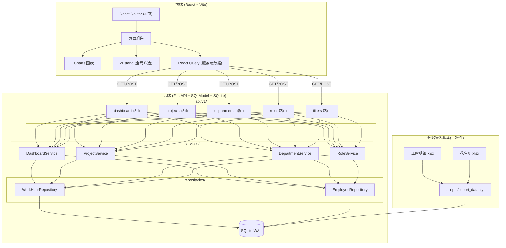
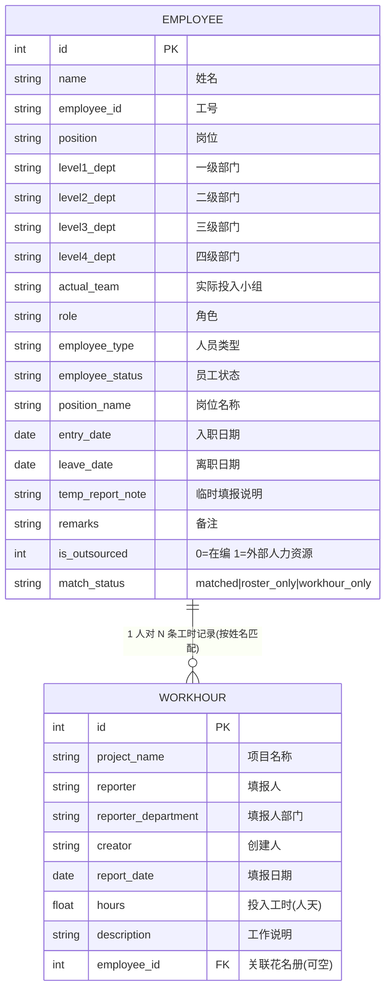
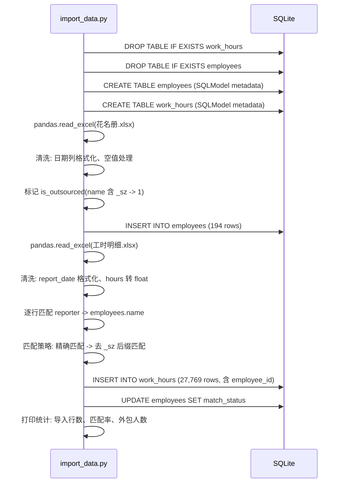
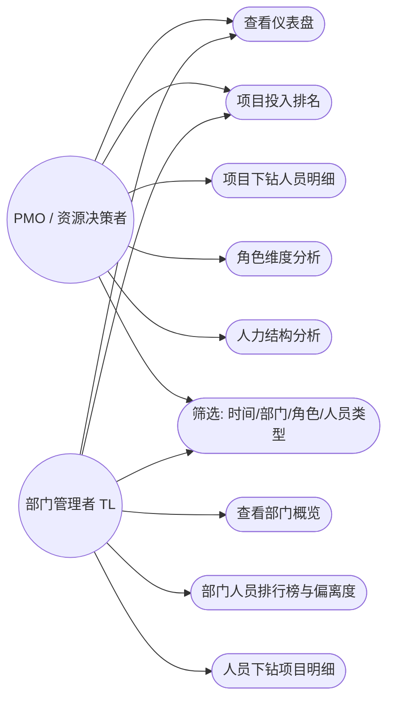

# 产能分析系统 · 架构方案

- 文档编号: 20260717143000-产能分析架构
- 定位: 基于工時明细 + 花名册的产能分析看板
- 状态: 待评审

---

## 一、背景与目标

PMO 与部门管理者(TL)需要一个可视化的产能分析工具, 从两份 Excel 数据源(工时明细 27,769 条 + 花名册 194 人)中提取关键指标: 投入人天、项目资源浓度、部门投入集中度、角色结构、个人偏离度等。

数据更新方式: 每月全量替换(新 Excel 覆盖导入)。MVP 不做权限、预算对比、趋势预测、Excel 导出。

---

## 二、架构总览(分层图)



---

## 三、数据模型设计

### 3.1 ER 图



### 3.2 实体设计决策

| 决策项 | 选择 | 理由 |
|--------|------|------|
| 花名册"计划投入项目1-5" | 不建独立字段, 存在备注字段 `remarks` 中 | 需求明确说"计划投入项目字段不管", YAGNI |
| work_hour.employee_id | 可空外键 | 13 人工时记录无花名册匹配(外包), employee_id=NULL |
| 外包标记 | `employees.is_outsourced` 整型 + work_hour 通过 employee_id 关联判断 | 名字含 `_sz` 且在花名册的人标 1; 有时工无花名册的人(employee_id=NULL)由查询层判断为外包 |
| 项目表 | 不建独立 `projects` 表 | work_hours 中 project_name 即全量项目, 聚合查询 GROUP BY project_name 足够; 避免冗余同步 |
| 部门表 | 不建独立 `departments` 表 | employees 中 level1-4 即部门全集; distinct 查询即可 |
| 存储单位 | `REAL`(浮点) | 人天可能有小数(如 0.5 人天) |

### 3.3 SQLModel 实体定义

两个实体, 每个实体按 SQLModel 全家桶拆 5 类: Base / Table / Create / Update / Public。

#### Employee

```
EmployeeBase: name, employee_id, position, level1_dept..level4_dept,
  actual_team, role, employee_type, employee_status, position_name,
  entry_date, leave_date, temp_report_note, remarks, is_outsourced, match_status
  -- 全量字段, 不含 id

Employee(EmployeeBase, table=True): + id(PK), created_at, updated_at
EmployeeCreate(EmployeeBase)
EmployeeUpdate(SQLModel): 全部字段 Optional
EmployeePublic(EmployeeBase): + id

索引: name(单列), level2_dept(单列), role(单列), employee_type(单列),
  employee_status(单列), is_outsourced(单列), match_status(单列)
```

#### WorkHour

```
WorkHourBase: project_name, reporter, reporter_department, creator,
  report_date, hours, description, employee_id -- 不含 id

WorkHour(WorkHourBase, table=True): + id(PK), created_at
WorkHourCreate(WorkHourBase)
WorkHourUpdate(SQLModel): 全部字段 Optional
WorkHourPublic(WorkHourBase): + id

索引: project_name(单列), reporter(单列), report_date(单列),
  employee_id(单列), (project_name, report_date) 复合索引
```

### 3.4 数据匹配逻辑(导入脚本执行)

```
对于每个 work_hour.reporter:
  1. 去除首尾空格
  2. 尝试精确匹配 employees.name
  3. 若精确匹配失败, 尝试去掉 reporter 末尾的 "_sz" 后再匹配
     (张三_sz -> 张三, 匹配成功则关联, 同时该员工 is_outsourced=1)
  4. 两次匹配都失败: employee_id=NULL, 在查询时按"外部人力资源"处理

匹配完成后:
  employees.match_status:
    - "matched": 花名册中有记录且至少一条 work_hour 关联
    - "roster_only": 花名册中有记录但零条 work_hour 关联
    - "workhour_only": 不存在(只有 work_hour 没有花名册的人不进 employees 表)
```

---

## 四、API 接口契约

全部挂 `/api/v1/`, 只用 GET / POST。时间筛选通过 query params `start_date` / `end_date` 传递,
筛选器参数 `department` / `role` / `personnel_type` / `project` 可选。

### 4.1 仪表盘

| 方法 | 路径 | 说明 |
|------|------|------|
| GET | `/dashboard/summary` | 顶部 4 卡片(总人天/填报人数/项目数/部门数) |
| GET | `/dashboard/monthly-trend` | 月度总人天趋势折线图 |

**GET /dashboard/summary**

Query: `start_date`, `end_date`, `department`, `role`, `personnel_type`(全部可选)

Response:
```json
{
  "total_person_days": 27123.5,
  "reporter_count": 169,
  "project_count": 59,
  "department_count": 12
}
```

**GET /dashboard/monthly-trend**

Query: 同上 + 可选 `project`

Response:
```json
[
  { "month": "2026-01", "total_days": 4521.0 },
  { "month": "2026-02", "total_days": 4380.5 },
  ...
]
```

### 4.2 项目投入看板

| 方法 | 路径 | 说明 |
|------|------|------|
| GET | `/projects/ranking` | 项目投入人天排行榜 |
| GET | `/projects/{project_name}/members` | 项目下钻: 人员投入明细 |
| GET | `/projects/{project_name}/monthly-trend` | 选定项目月度趋势 |

**GET /projects/ranking**

Query: `start_date`, `end_date`, `department`, `role`, `personnel_type`

Response:
```json
[
  {
    "project_name": "XX管理系统",
    "total_days": 3500.0,
    "member_count": 28,
    "avg_days_per_person": 125.0,
    "concentration": 125.0
  }
]
// concentration = total_days / member_count (项目资源浓度)
```

**GET /projects/{project_name}/members**

Query: `start_date`, `end_date`, `department`, `role`, `personnel_type`

Response:
```json
[
  {
    "employee_id": 1,
    "name": "张三",
    "role": "后端开发",
    "department": "技术部-基础平台",
    "total_days": 55.0,
    "monthly_breakdown": [
      { "month": "2026-01", "days": 10.0 },
      { "month": "2026-02", "days": 9.0 }
    ]
  }
]
```

**GET /projects/{project_name}/monthly-trend**

Query: `start_date`, `end_date`

Response: 同 dashboard monthly-trend 结构

### 4.3 部门/团队看板

| 方法 | 路径 | 说明 |
|------|------|------|
| GET | `/departments/overview` | 部门概况(总人天/人均人天/项目分布饼图/集中度) |
| GET | `/departments/members` | 人员投入排行榜(含偏离度) |
| GET | `/departments/members/{employee_id}/projects` | 某人下钻: 项目投入明细 + 月度分布 |

**GET /departments/overview**

Query: `start_date`, `end_date`, `department`(必需), `level`(2 或 3, 默认 2)

Response:
```json
{
  "total_person_days": 8500.0,
  "avg_person_days": 98.0,
  "member_count": 87,
  "project_distribution": [
    { "project_name": "项目A", "total_days": 2000.0, "percentage": 23.5 }
  ],
  "top_n_concentration": {
    "top3_percentage": 65.0,
    "top5_percentage": 82.0
  }
}
```

**GET /departments/members**

Query: `start_date`, `end_date`, `department`(必需), `level`(默认 2), `role`, `personnel_type`

Response:
```json
[
  {
    "employee_id": 1,
    "name": "张三",
    "role": "后端开发",
    "department": "技术部-基础平台",
    "total_days": 80.0,
    "peer_avg_days": 50.0,
    "deviation": 0.6,
    "deviation_level": "red"
  }
]
// deviation = (total_days - peer_avg_days) / peer_avg_days
// deviation_level: "normal"(<=0.5) | "yellow"(>0.5, <=1.0) | "red"(>1.0)
```

**GET /departments/members/{employee_id}/projects**

Query: `start_date`, `end_date`

Response:
```json
[
  {
    "project_name": "项目A",
    "total_days": 30.0,
    "monthly_breakdown": [
      { "month": "2026-01", "days": 5.0 }
    ]
  }
]
```

### 4.4 角色维度分析

| 方法 | 路径 | 说明 |
|------|------|------|
| GET | `/roles/aggregation` | 按角色聚合 + 部门分布 |
| GET | `/roles/structure` | 人力结构饼图(员工状态维度) |

**GET /roles/aggregation**

Query: `start_date`, `end_date`, `department`

Response:
```json
[
  {
    "role": "后端开发",
    "total_days": 5000.0,
    "person_count": 45,
    "dept_distribution": [
      { "department": "技术部", "person_count": 20, "total_days": 2500.0 }
    ]
  }
]
```

**GET /roles/structure**

Query: `start_date`, `end_date`, `department`

Response:
```json
[
  { "employee_status": "正式", "total_days": 20000.0, "person_count": 140, "percentage": 73.5 },
  { "employee_status": "离职", "total_days": 1500.0, "person_count": 10, "percentage": 5.5 }
]
```

### 4.5 筛选器选项

| 方法 | 路径 | 说明 |
|------|------|------|
| GET | `/filters/options` | 返回所有可用筛选维度值(供前端下拉框) |

**GET /filters/options**

Response:
```json
{
  "departments": ["技术部", "产品部", "测试部"],
  "roles": ["后端开发", "前端开发", "测试", "PM"],
  "personnel_types": ["在编", "外部人力资源"],
  "employee_statuses": ["正式", "离职", "兼岗", "实习", "顾问"],
  "projects": ["项目A", "项目B"],
  "date_range": { "min": "2026-01-04", "max": "2026-06-30" }
}
```

### 4.6 关键业务指标计算公式

| 指标 | 公式 | 备注 |
|------|------|------|
| 人均人天 | `SUM(hours) / COUNT(DISTINCT reporter)` | 部门维度用该部门人数 |
| 项目资源浓度 | `项目总人天 / 项目参与人数` | 值越大说明人力越集中 |
| 偏离度 | `(个人人天 - 同级均值) / 同级均值` | "同级"=同一筛选范围(同部门/同角色)内所有人的平均人天 |
| 偏离度等级 | normal(<=0.5) / yellow(0.5~1.0) / red(>1.0) | 绝对值判断 |
| 部门投入集中度 | `Top N 项目人天 / 部门总人天` | 默认 N=3 和 N=5 |

---

## 五、后端模块拆分

### 5.1 文件结构

```
apps/back/app/
├── api/
│   ├── deps.py                              # 新增 4 组依赖注入
│   └── v1/
│       ├── __init__.py                      # 新增 5 个 router include
│       ├── dashboard.py                     # 仪表盘路由
│       ├── projects.py                      # 项目看板路由
│       ├── departments.py                   # 部门看板路由
│       ├── roles.py                         # 角色分析路由
│       └── filters.py                       # 筛选器选项路由
├── services/
│   ├── dashboard_service.py
│   ├── project_service.py
│   ├── department_service.py
│   ├── role_service.py
│   └── filter_service.py
├── repositories/
│   ├── work_hour_repository.py              # 工时数据访问(聚合查询)
│   └── employee_repository.py              # 花名册数据访问
├── models/
│   ├── work_hour.py                         # 工时实体 + DTO
│   └── employee.py                          # 花名册实体 + DTO
├── db/
│   └── base.py                              # 注册新模型
└── scripts/
    └── import_data.py                       # 数据导入脚本(一次性)
```

### 5.2 分层职责

| 层 | 文件 | 职责 |
|----|------|------|
| route | `api/v1/dashboard.py` 等 | 收 query params, 调 service, 返 dict/list |
| service | `services/dashboard_service.py` 等 | 聚合计算(人天汇总/偏离度/集中度), 抛 NotFoundError |
| repository | `repositories/work_hour_repository.py` | GROUP BY / SUM / COUNT 查询, JOIN employees |
| repository | `repositories/employee_repository.py` | employees 的 distinct/筛选查询 |

### 5.3 Repository 层关键查询方法

**WorkHourRepository:**

```python
class WorkHourRepository:
    # 聚合查询: 按项目分组统计人天
    async def aggregate_by_project(filters) -> list[AggregatedRow]
    # 聚合查询: 按月分组统计人天(可选按项目/部门筛选)
    async def aggregate_by_month(filters) -> list[MonthlyRow]
    # 按人分组统计人天(含月度拆分)
    async def aggregate_by_person(filters) -> list[PersonAggRow]
    # 按人+项目分组统计
    async def aggregate_by_person_project(filters) -> list[PersonProjectRow]
    # 按角色分组统计
    async def aggregate_by_role(filters) -> list[RoleAggRow]
    # 按员工状态分组统计
    async def aggregate_by_status(filters) -> list[StatusAggRow]
```

**EmployeeRepository:**

```python
class EmployeeRepository:
    # 获取部门列表(distinct level2_dept 或 level3_dept)
    async def list_departments(level: int) -> list[str]
    # 获取角色列表
    async def list_roles() -> list[str]
    # 获取人员类型列表
    async def list_personnel_types() -> list[str]
    # 按部门获取人员列表
    async def list_by_department(dept: str, level: int) -> list[Employee]
```

### 5.4 Service 层关键业务逻辑

**DepartmentService.deviation_calculation:**
```
1. 查询该部门所有人的人天合计(每人 sum)
2. 计算同级均值 = 所有人天合计 / 人数
3. 对每个人: deviation = (个人人天 - 均值) / 均值
4. 标记: |deviation| > 0.5 -> yellow, > 1.0 -> red
```

**DepartmentService.concentration_calculation:**
```
1. 查询该部门的项目投入分布(按项目 sum hours)
2. 按 total_days 降序排列
3. top_n_percentage = SUM(top N 项目人天) / 部门总人天 * 100
```

### 5.5 筛选器查询的通用过滤条件

所有聚合查询方法接受同一组 `filters` 参数:

```python
class QueryFilters:
    start_date: date | None = None
    end_date: date | None = None
    department: str | None = None    # 部门名(匹配 level2 或 level3)
    department_level: int = 2        # 2 或 3
    role: str | None = None
    personnel_type: str | None = None  # "在编" or "外部人力资源"
    project_name: str | None = None
```

外层人员类型筛选: "在编" = employees.is_outsourced=0,"外部人力资源" = employees.is_outsourced=1 OR work_hour.employee_id IS NULL。

### 5.6 依赖注入(deps.py 新增)

```python
# 新增 4 组
def get_work_hour_repository(session) -> WorkHourRepository
WorkHourRepositoryDep = Annotated[...]

def get_employee_repository(session) -> EmployeeRepository
EmployeeRepositoryDep = Annotated[...]

def get_dashboard_service(wh_repo, emp_repo) -> DashboardService
DashboardServiceDep = Annotated[...]

# ProjectService, DepartmentService, RoleService, FilterService 同理
```

---

## 六、数据导入脚本设计

### 6.1 位置与调用方式

`apps/back/scripts/import_data.py` -- 独立 CLI 脚本, 不含在 FastAPI 请求链路中。

调用方式:
```bash
cd apps/back
uv run python scripts/import_data.py --workhour path/to/工时明细.xlsx --roster path/to/花名册.xlsx
```

### 6.2 执行流程



### 6.3 数据清洗规则

| 问题 | 处理方式 |
|------|----------|
| Excel 日期列读取为 datetime 对象 | `pd.to_datetime().dt.strftime('%Y-%m-%d')` |
| 空单元格 | 字符串列填 `""`, 数值列填 `0` |
| 工时列可能有字符串或空 | `pd.to_numeric(errors='coerce').fillna(0)` |
| 姓名前后空格 | `str.strip()` |
| 离职日期为空 | 保留 NULL |
| 花名册姓名含 `_sz` | 去后缀匹配, 原样存储 |

### 6.4 幂等性

每次运行先 DROP 旧表再 CREATE, 保证全量替换幂等。

---

## 七、前端路由与组件树

### 7.1 新增依赖

`react-router-dom`(v6+) -- 用于客户端路由。当前 package.json 中无此依赖, 需新增。

### 7.2 路由设计

| 路径 | 页面 | 说明 |
|------|------|------|
| `/` | `DashboardPage` | 首页仪表盘 |
| `/projects` | `ProjectsPage` | 项目投入看板 |
| `/projects/:name` | `ProjectDetailPage` | 项目下钻(可选用 modal 替代) |
| `/departments` | `DepartmentsPage` | 部门/团队看板 |
| `/departments/:id` | `DepartmentDetailPage` | 部门下钻 |
| `/roles` | `RolesPage` | 角色维度分析 |

### 7.3 组件树

```
App
└── Layout
    ├── Sidebar
    │   ├── NavItem("仪表盘", "/")
    │   ├── NavItem("项目看板", "/projects")
    │   ├── NavItem("部门看板", "/departments")
    │   └── NavItem("角色分析", "/roles")
    ├── Header
    │   └── GlobalFilterBar
    │       ├── DateRangePicker (月/季/自定义)
    │       ├── DepartmentSelect (下拉)
    │       ├── RoleSelect (下拉)
    │       ├── PersonnelTypeSelect (下拉)
    │       └── ResetButton
    └── <Outlet> (页面内容区)
        ├── DashboardPage
        │   ├── SummaryCards (4 个 KPI 卡片)
        │   │   ├── StatCard("总人天")
        │   │   ├── StatCard("填报人数")
        │   │   ├── StatCard("项目数")
        │   │   └── StatCard("部门数")
        │   └── MonthlyTrendChart (ECharts 折线图)
        │
        ├── ProjectsPage
        │   ├── ProjectRankingTable (可排序表格)
        │   ├── ProjectRankingBarChart (ECharts 柱状图)
        │   └── ProjectDrilldownModal / ProjectDetailPage
        │       ├── MemberDetailTable
        │       └── ProjectMonthlyTrendChart (ECharts)
        │
        ├── DepartmentsPage
        │   ├── DepartmentSelector (Tab 或下拉, 默认二级部门)
        │   ├── DepartmentLevelToggle (二级/三级切换)
        │   ├── DepartmentOverviewPanel
        │   │   ├── SummaryCards (总人天/人均人天/项目数)
        │   │   ├── ProjectDistributionPieChart (ECharts 饼图)
        │   │   └── ConcentrationBar (Top-N 柱状图)
        │   ├── MemberRankingTable
        │   │   └── DeviationBadge (黄/红标签)
        │   └── MemberDrilldownModal
        │       ├── MemberProjectTable
        │       └── MemberMonthlyTrendChart (ECharts)
        │
        └── RolesPage
            ├── RoleAggregationTable
            ├── RoleDeptDistributionChart (ECharts 堆叠柱状图)
            └── PersonnelStructurePieChart (ECharts 饼图)
```

### 7.4 前端文件结构

```
apps/web/src/
├── api/
│   ├── client.ts                    # 扩展: 新增 capacity API 模块
│   └── capacity.ts                  # 产能分析 API 封装
├── components/
│   ├── layout/
│   │   ├── Layout.tsx              # 全局布局(Sidebar + Header + Outlet)
│   │   ├── Sidebar.tsx             # 侧边导航
│   │   └── GlobalFilterBar.tsx     # 全局筛选栏
│   ├── dashboard/
│   │   ├── SummaryCards.tsx
│   │   └── MonthlyTrendChart.tsx
│   ├── projects/
│   │   ├── ProjectRankingTable.tsx
│   │   ├── ProjectRankingBarChart.tsx
│   │   ├── ProjectDrilldownModal.tsx
│   │   └── MemberDetailTable.tsx
│   ├── departments/
│   │   ├── DepartmentSelector.tsx
│   │   ├── DepartmentOverviewPanel.tsx
│   │   ├── MemberRankingTable.tsx
│   │   ├── DeviationBadge.tsx
│   │   └── MemberDrilldownModal.tsx
│   ├── roles/
│   │   ├── RoleAggregationTable.tsx
│   │   ├── RoleDeptDistributionChart.tsx
│   │   └── PersonnelStructurePieChart.tsx
│   └── shared/
│       ├── StatCard.tsx             # 可复用 KPI 卡片
│       ├── FilterSelect.tsx         # 可复用筛选下拉
│       ├── LoadingSpinner.tsx
│       └── EmptyState.tsx
├── hooks/
│   ├── useDashboard.ts              # React Query hooks: summary, monthlyTrend
│   ├── useProjects.ts               # React Query hooks: ranking, members, trend
│   ├── useDepartments.ts            # React Query hooks: overview, members, memberProjects
│   ├── useRoles.ts                  # React Query hooks: aggregation, structure
│   └── useFilters.ts                # React Query hook: filter options
├── stores/
│   └── useFilterStore.ts            # Zustand: 全局筛选状态
├── pages/
│   ├── DashboardPage.tsx
│   ├── ProjectsPage.tsx
│   ├── ProjectDetailPage.tsx
│   ├── DepartmentsPage.tsx
│   ├── DepartmentDetailPage.tsx
│   └── RolesPage.tsx
├── App.tsx                           # 改造: 引入 React Router
└── main.tsx                          # 不变
```

### 7.5 状态管理方案

| 状态类型 | 工具 | 说明 |
|----------|------|------|
| 全局筛选器 | Zustand (`useFilterStore`) | start_date, end_date, department, role, personnel_type, project 六个字段 |
| 服务端数据 | React Query | 每个页面的数据查询, queryKey 包含当前筛选值(自动 refetch) |
| 页面 UI 状态 | 组件内 `useState` | modal 开关、选中行、排序方向等 |

FilterStore 示例结构:
```typescript
interface FilterState {
  startDate: string | null;
  endDate: string | null;
  department: string | null;
  role: string | null;
  personnelType: string | null;
  project: string | null;
  // actions
  setFilter: (key, value) => void;
  resetFilters: () => void;
}
```

---

## 八、关键技术决策(ADR)

### ADR-1: 不建独立项目表/部门表

**决策**: 项目名和部门名直接从 work_hours 和 employees 表中 DISTINCT 查询, 不建独立表。

**理由**:
- 数据是全量替换, 不存在增量同步问题, 无冗余一致性问题
- 项目只有 59 个, 部门只有十几个, DISTINCT 查询开销可忽略
- 减少表数量, 降低维护成本

**备选**: 若未来数据量激增或需要项目/部门元数据(负责人等), 可建独立表。

### ADR-2: 偏离度计算放在 Service 层而非 SQL

**决策**: 偏离度(deviation)在 Python service 层计算, 而非 SQL。

**理由**:
- 需要先算均值再逐人比较, SQL 中用窗口函数可做但 SQLite 对复杂窗口函数支持有限
- Python 中计算更直观、可测试、可调试
- 数据量小(最多 169 人), 内存计算完全够用

### ADR-3: 部门下钻用 query param 而非 path param

**决策**: 部门筛选用 `?department=技术部&level=2` 而非 `/departments/技术部/`。

**理由**:
- 部门名含中文、可能有特殊字符, URL 编码麻烦
- 与其他筛选参数(时间/角色)一致, 全部走 query params
- 前端构造简单, 不需要手动 encodeURIComponent

### ADR-4: 前端下钻优先用 Modal, 备选独立页面

**决策**: 项目下钻和人员下钻默认用 Modal 弹窗, 保留独立路由作为深层链接支持。

**理由**:
- Modal 不丢失当前页面筛选状态和滚动位置
- 用户体验更流畅(上下文保持)
- 独立路由(/projects/:name)通过 React Router 提供, 满足分享链接需求

### ADR-5: 导入脚本用 pandas + SQLModel 混用

**决策**: 读取 Excel 用 pandas(性能好、处理日期方便), 写入 SQLite 用 SQLModel(利用已有模型定义保证一致性)。

**理由**:
- pandas 读 Excel 比 openpyxl 原生 API 简洁太多
- SQLModel 的 `create_all` 保证表结构与模型定义一致
- 导入是离线操作, 不需要 async

---

## 九、用例图



---

## 十、开发任务拆解

### P0: 核心闭环(约 14h, 前后端可并行)

| # | 任务 | 负责 | 预估 | 依赖 | 可并行 |
|---|------|------|------|------|--------|
| P0-1 | 数据模型: Employee + WorkHour SQLModel 实体, db/base.py 注册 | 后端 | 1h | - | - |
| P0-2 | 数据导入脚本: import_data.py(读 Excel、清洗、匹配、落库) | 后端 | 3h | P0-1 | - |
| P0-3 | Repository 层: WorkHourRepository + EmployeeRepository | 后端 | 2h | P0-1 | P0-2 |
| P0-4 | Service 层: Dashboard/Project/Department/Role/Filter 5 个 service | 后端 | 3h | P0-3 | - |
| P0-5 | API 路由: 仪表盘 + 项目 + 部门 + 角色 + 筛选器(5 个 route 文件) | 后端 | 2h | P0-4 | - |
| P0-6 | deps.py 新增依赖注入 + v1/__init__.py 注册路由 | 后端 | 0.5h | P0-5 | - |
| P0-7 | 前端基础设施: react-router-dom 集成, Layout/Sidebar 组件 | 前端 | 2h | - | P0-1~P0-6 |
| P0-8 | 前端 API 层: capacity.ts 接口封装 + useFilters hook | 前端 | 1.5h | P0-5(接口契约) | P0-7 |
| P0-9 | 前端 Dashboard 页面: SummaryCards + MonthlyTrendChart | 前端 | 2h | P0-8 | P0-10/P0-11 |
| P0-10 | 前端 Projects 页面: 排名表格 + 柱状图 + 下钻 Modal | 前端 | 3h | P0-8 | P0-9 |
| P0-11 | 前端 Departments 页面: 概览面板 + 人员排行榜 + 偏离度标记 + 下钻 | 前端 | 3h | P0-8 | P0-10 |
| P0-12 | 前端 Roles 页面: 角色聚合表 + 部门分布图 + 人力结构饼图 | 前端 | 2h | P0-8 | P0-10 |

### P1: 增强功能(约 8h, 前后端可并行)

| # | 任务 | 负责 | 预估 | 依赖 |
|---|------|------|------|------|
| P1-1 | 前端全局筛选器: Zustand store + GlobalFilterBar 组件联动所有页面 | 前端 | 2h | P0-9~P0-12 |
| P1-2 | 部门层级切换: 二级/三级 toggle, 后端 API 支持 level 参数 | 前后端 | 1.5h | P0-5, P0-11 |
| P1-3 | 时间范围快捷切换: 月/季/自定义 DateRangePicker | 前端 | 1.5h | P1-1 |
| P1-4 | 项目资源浓度 + 部门集中度指标展示 | 前后端 | 1.5h | P0-4, P0-10 |
| P1-5 | 前端 loading/empty/error 三态打磨 | 前端 | 1.5h | P0-9~P0-12 |

### P2: 质量收尾(约 6h)

| # | 任务 | 负责 | 预估 | 依赖 |
|---|------|------|------|------|
| P2-1 | 后端单元测试: repository + service(内存 SQLite) | 后端 | 2h | P0-3, P0-4 |
| P2-2 | 后端集成测试: API 路由(client fixture) | 后端 | 1.5h | P0-5 |
| P2-3 | 后端覆盖率补齐到 >=80% | 后端 | 1h | P2-1, P2-2 |
| P2-4 | 前端组件测试: Vitest(关键组件渲染) | 前端 | 1h | P0-9~P0-12 |
| P2-5 | pnpm check 全绿: Ruff + mypy + pytest / Biome + tsc + Vitest | 前后端 | 0.5h | P2-1~P2-4 |

### 执行顺序建议

```
P0-1 -> P0-2(导入脚本)    ┐
P0-1 -> P0-3(Repository)  ├─ 后端主线(约 11.5h)
P0-3 -> P0-4(Service)     │
P0-4 -> P0-5(Route)       │
P0-5 -> P0-6(deps)        ┘

                              ┐
P0-7 -> P0-8(API 层)         │
P0-8 -> P0-9(Dashboard)     ├─ 前端主线(约 11.5h, 与后端并行)
P0-8 -> P0-10(Projects)     │
P0-8 -> P0-11(Departments)  │
P0-8 -> P0-12(Roles)        ┘

P0 全部 -> P1-1~P1-5(增强, 约 8h)
P1 全部 -> P2-1~P2-5(质量, 约 6h)

总计: 约 28h(后端 14h + 前端 11h + 质量 6h, 考虑并行后约 3-4 个工作日)
```

---

## 十一、与母版约束对照检查

| 约束 | 本方案 |
|------|--------|
| 后端三层(route->service->repository) | [PASS] 严格三层, service 不碰 session |
| 只用 GET/POST | [PASS] 全部 GET(查询) + POST(仅导入时备选, MVP 无 POST 写操作) |
| API 版本化 /api/v1/ | [PASS] 全部挂 `/api/v1/` |
| SQLModel 全家桶 | [PASS] Base/Table/Create/Update/Public 五件套 |
| DTO 不分离纯 Pydantic | [PASS] |
| 依赖注入 deps.py | [PASS] session->repository->service->route |
| 前端轻约束 | [PASS] 手写 API client, 不用 openapi-typescript 强制 |
| 不预置鉴权/部署 | [PASS] MVP 无鉴权 |
| YAGNI | [PASS] 不做权限/预算对比/趋势预测/Excel 导出/计划项目匹配 |
