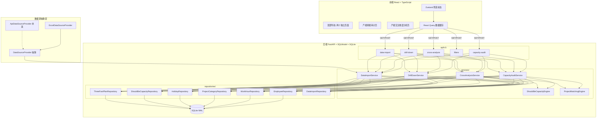
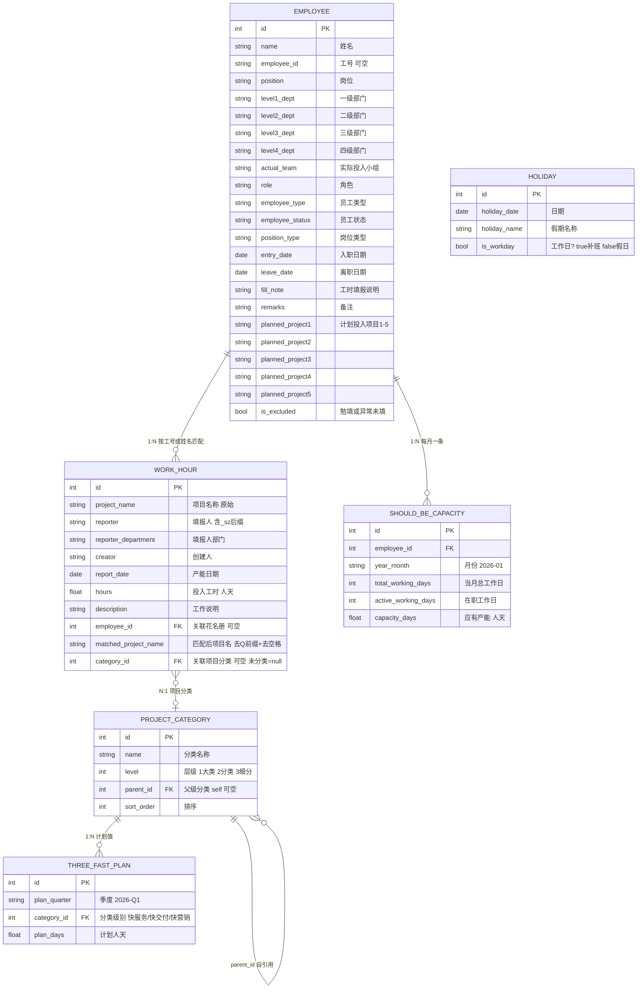
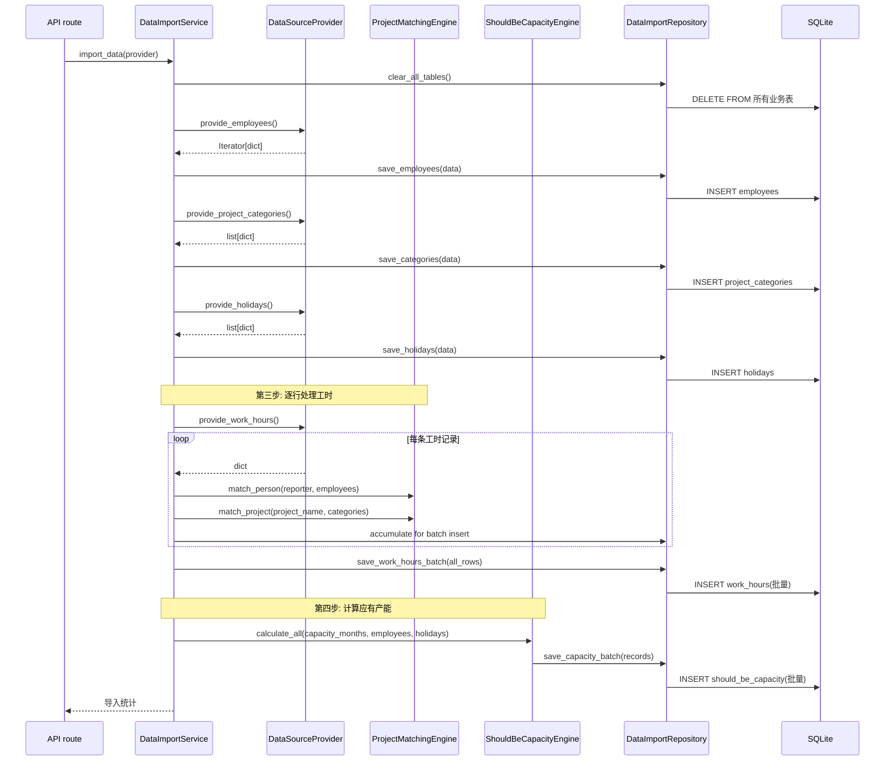
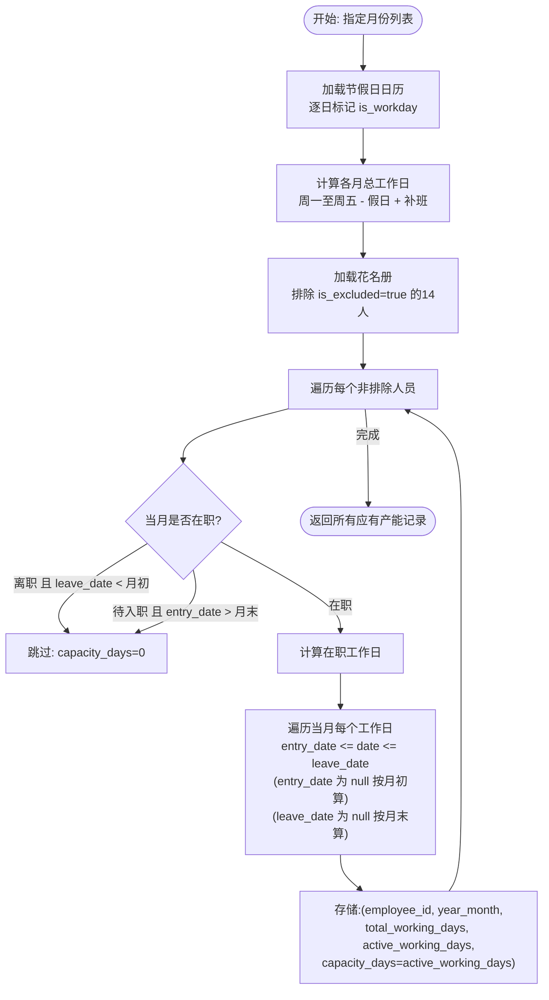
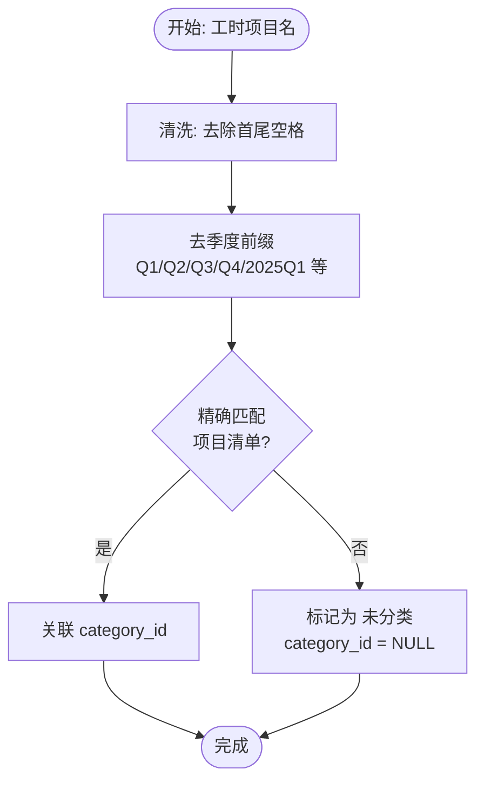
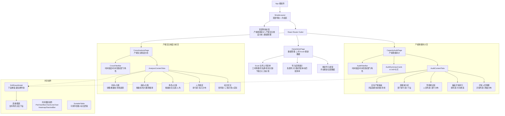
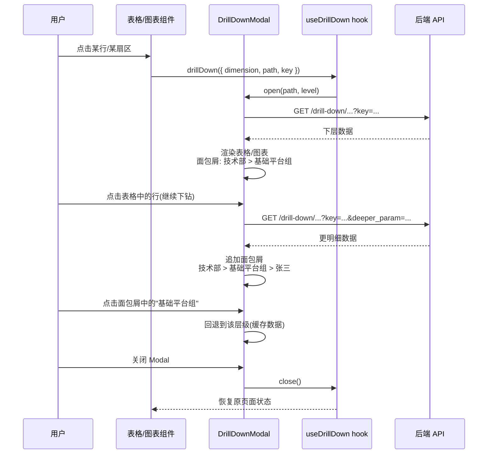

# 产能分析系统 v2 · 架构方案

- 文档编号: 20260717234000-产能分析系统需求 | 版本: v1.0 | 日期: 2026-07-18 | 状态: 已评审
- 基于: 需求规格 v2.1 | 母版架构方案 20260715

---

## 一、背景与目标

### 1.1 定位

v1 系统已实现投入人天分析。v2 核心升级: 从"只看实际填了多少"升级为"应有 vs 实际的产能审计 + 多维度交叉分析"。

### 1.2 与 v1 的关键差异

| 维度 | v1 | v2 |
|------|----|----|
| 核心指标 | 实际人天、偏离度(相对均值) | 应有产能、实际产能、偏差(绝对)、填报率 |
| 分析框架 | 四页看板(仪表盘/项目/部门/角色) | 两模块: 产能填报审计 + 产能交叉维度分析 |
| 项目分类 | 无 | 三快类/研发类/周期类 三级体系 |
| 应有产能 | 无 | 预计算, 按人+月, 含中途入离职折算 |
| 节假日 | 无 | 4 假期 + 3 补班日影响工作日 |
| 数据穿透 | 简单下钻(Modal) | 多层级路径穿透(汇总->分类->项目->个人->记录) |
| 外部人力资源 | `is_outsourced` 标记 | 花名册统一管理(工号为空时去 `_sz` 匹配), 勉填 14 人排除 |
| 三快计划 | 无 | 快服务/快交付/快营销 Q1/Q2 计划 vs 实际 |

---

## 二、架构总览



---

## 三、数据模型设计

### 3.1 ER 图



### 3.2 表结构设计详述

#### 3.2.1 花名册 (employees)

存储 194 人花名册全量字段。角色、计划投入项目等冗余字段保留但不作为主分析维度(需求明确说计划投入项目不管)。

```python
class EmployeeBase(SQLModel):
    name: str
    employee_id: str | None = None          # 工号, 外包人员可能为空
    position: str | None = None              # 岗位
    level1_dept: str | None = None           # 一级部门
    level2_dept: str | None = None           # 二级部门(分析主维度)
    level3_dept: str | None = None           # 三级部门
    level4_dept: str | None = None           # 四级部门
    actual_team: str | None = None           # 实际投入小组
    role: str | None = None                  # 角色
    employee_type: str | None = None         # 员工类型
    employee_status: str | None = None       # 员工状态
    position_type: str | None = None         # 岗位类型
    entry_date: date | None = None           # 入职日期
    leave_date: date | None = None           # 离职日期
    fill_note: str | None = None             # 工时填报说明("勉填"/"异常未填")
    remarks: str | None = None
    planned_project1: str | None = None
    planned_project2: str | None = None
    planned_project3: str | None = None
    planned_project4: str | None = None
    planned_project5: str | None = None
    is_excluded: bool = False                # 是否排除(勉填/异常未填)

class Employee(EmployeeBase, table=True):
    __tablename__ = "employees"
    id: int | None = Field(default=None, primary_key=True)
    created_at: datetime = Field(default_factory=utcnow)
    updated_at: datetime = Field(default_factory=utcnow)

# 索引
# - employee_id (唯一, 工号不为空时)
# - level2_dept (部门筛选)
# - employee_status (在职状态筛选)
# - is_excluded (排除标记)
```

#### 3.2.2 工时明细 (work_hours)

存储 27,769 条工时记录。保留原始填报人名称, 同时存储匹配后的员工 ID 和项目分类 ID。

```python
class WorkHourBase(SQLModel):
    project_name: str                          # 原始项目名
    reporter: str                              # 原始填报人(含_sz后缀)
    reporter_department: str | None = None     # 填报人部门(辅助, 不做分析依据)
    creator: str | None = None                 # 创建人
    report_date: date                          # 产能日期
    hours: float = Field(default=0)            # 投入工时(人天)
    description: str | None = None             # 工作说明
    employee_id: int | None = None             # 匹配后关联花名册(NULL=未匹配)
    matched_project_name: str | None = None    # 清洗后项目名(去Q前缀+去空格)
    category_id: int | None = None             # 项目三级分类ID(NULL=未分类)

class WorkHour(WorkHourBase, table=True):
    __tablename__ = "work_hours"
    id: int | None = Field(default=None, primary_key=True)
    created_at: datetime = Field(default_factory=utcnow)

# 索引
# - (employee_id, report_date) 复合索引(最常用查询)
# - report_date (时间筛选)
# - matched_project_name (项目筛选)
# - category_id (分类筛选)
```

#### 3.2.3 项目分类 (project_categories)

自引用树形表, 存储 13 个细分分类 -> 6 个分类 -> 3 个大类的三级体系。

```python
class ProjectCategory(SQLModel, table=True):
    __tablename__ = "project_categories"
    id: int | None = Field(default=None, primary_key=True)
    name: str                                   # 分类名称
    level: int = Field(ge=1, le=3)             # 1=大类 2=分类 3=细分
    parent_id: int | None = Field(default=None, foreign_key="project_categories.id")
    sort_order: int = 0                         # 排序序号

# 预置数据(导入时写入):
#  1,"三快类",   1,NULL   -> 快服务(2,parent=1) -> 快服务迭代(3,parent=快服务.id)
#                     |                         -> 快服务子专项(3,parent=快服务.id)
#                     -> 快交付(2,parent=1)     -> ...
#                     -> 快营销(2,parent=1)     -> ...
#  2,"研发类",   1,NULL   -> 创新专项(2,parent=2)
#                     -> 发版专项(2,parent=2)
#  3,"周期类",   1,NULL   -> 配置组周期项目(2,parent=3)
#                     -> 其他(2,parent=3)       -> 日常运营&管理(3,parent=其他.id)
#                                               -> 临时会议(3,parent=其他.id)
#                                               -> 请休假(3,parent=其他.id)
#                                               -> 其他工作(3,parent=其他.id)
#  4,"未分类",   1,NULL   # 虚拟分类, 匹配失败的项目归入此
```

设计决策: 不建独立项目清单表。工时明细中的项目名去 Q 前缀后通过 `matched_project_name` 直接关联到 `project_categories.id`(细分层)。匹配失败的 `category_id = NULL`, 查询时映射到"未分类"。

#### 3.2.4 节假日 (holidays)

存储假期和补班日, 用于工作日计算。

```python
class Holiday(SQLModel, table=True):
    __tablename__ = "holidays"
    id: int | None = Field(default=None, primary_key=True)
    holiday_date: date                           # 日期
    holiday_name: str                            # 假期名称
    is_workday: bool                             # false=假日 true=补班日
```

预置 7 条记录: 4 个假期(每个可能跨多天, 逐日存储) + 3 个补班日。

#### 3.2.5 应有产能 (should_be_capacity)

预计算存储, 按人+月。

```python
class ShouldBeCapacity(SQLModel, table=True):
    __tablename__ = "should_be_capacity"
    id: int | None = Field(default=None, primary_key=True)
    employee_id: int = Field(foreign_key="employees.id")
    year_month: str                              # "2026-01"
    total_working_days: int                      # 当月总工作日(周一至周五-假日+补班)
    active_working_days: int                     # 当月在职工作日数
    capacity_days: float                         # 应有产能(人天) = active_working_days

# 唯一约束: (employee_id, year_month)
# 索引: (year_month), (employee_id)
```

#### 3.2.6 三快产能计划 (three_fast_plans)

```python
class ThreeFastPlan(SQLModel, table=True):
    __tablename__ = "three_fast_plans"
    id: int | None = Field(default=None, primary_key=True)
    plan_quarter: str                            # "2026-Q1" / "2026-Q2"
    category_id: int = Field(foreign_key="project_categories.id")  # 快服务/快交付/快营销(分类层)
    plan_days: float                             # 计划人天
```

### 3.3 实体设计决策

| 决策项 | 选择 | 理由 |
|--------|------|------|
| 项目分类表 | 自引用树形表, 不硬编码 | 需求要求"动态可配置" |
| 项目清单表 | 不建独立表 | 项目与分类通过 `category_id` 直接关联; 全量替换导入无需同步 |
| 部门表 | 不建独立表 | 从 employees DISTINCT 查询, 数据量极小 |
| 工时表 `category_id` | 导入时计算存储, 不实时匹配 | 写入一次、查询多次; 避免每次查询都做字符串匹配 |
| 应有产能存储 | 预计算, 导入时触发 | 194 人 x 6 月 = 1,164 行, 避免每次查询都重新算在职天数 |
| 人员匹配 | 导入时执行, 存储 employee_id | 匹配逻辑复杂(去后缀/工号优先/重名处理), 查询时直接 JOIN |
| 工时记录单位 | `REAL`(浮点) | 人天可能有小数 |
| `is_excluded` 字段 | 布尔类型 | 标记勉填/异常未填 14 人, 在应有产能计算和应用层直接排除 |

---

## 四、API 接口契约

全部挂载 `/api/v1/`, 只用 GET / POST。公共筛选参数含义:

| 参数 | 类型 | 说明 |
|------|------|------|
| `time_granularity` | str | month / quarter / half, 返回数据的聚合粒度 |
| `time_period` | str | 2026-H1 / 2026-Q1 / 2026-Q2 / 2026-01 ~ 2026-06 |
| `dept_level` | int | 部门层级 1-4 |
| `dept_name` | str | 指定部门名称 |
| `dept_path` | str | 下钻路径, 如 "技术部/基础平台组" |
| `role` | str | 角色筛选 |
| `category_id` | int | 项目分类ID, 用于下钻 |
| `sort_by` | str | 排序字段 |
| `sort_dir` | str | asc / desc |

### 4.1 产能填报审计

#### 4.1.1 审计汇总 KPI

**GET /capacity-audit/summary**

Query: `time_period`, `dept_level`, `dept_name`, `role`(全部可选)

Response:
```json
{
  "should_be_days": 12345.0,
  "actual_days": 11234.5,
  "fill_rate": 91.02,
  "deviation": -1110.5,
  "employee_count": 180,
  "zero_fill_count": 5,
  "abnormal_count": 12
}
```

#### 4.1.2 月度应有 vs 实际趋势

**GET /capacity-audit/monthly-trend**

Query: 同上

Response:
```json
[
  {
    "month": "2026-01",
    "should_be_days": 2100.0,
    "actual_days": 1950.5,
    "fill_rate": 92.88,
    "deviation": -149.5,
    "working_days": 22
  }
]
```

#### 4.1.3 部门填报率排行

**GET /capacity-audit/department-fill-rate**

Query: `time_period`, `dept_level`(默认 2), `parent_dept`(下钻时传入上级部门名), `role`

Response:
```json
[
  {
    "dept_name": "技术部",
    "dept_path": "技术部",
    "dept_level": 2,
    "should_be_days": 5000.0,
    "actual_days": 4800.0,
    "fill_rate": 96.0,
    "deviation": -200.0,
    "abnormal_count": 3,
    "person_count": 85,
    "has_children": true
  }
]
```

说明: 首次请求 `dept_level=2` 不传 `parent_dept`, 返回所有二级部门。点击某部门下钻时 `parent_dept=技术部&dept_level=3`, 返回该部门下的三级部门。`has_children` 标识是否可以继续下钻。

#### 4.1.4 零填报人员

**GET /capacity-audit/zero-filling**

Query: `time_period`, `dept_level`, `dept_name`

Response:
```json
[
  {
    "employee_id": 15,
    "name": "张三",
    "employee_id_str": "11800123",
    "dept_name": "技术部-基础平台组",
    "dept_path": "技术部/基础平台组",
    "role": "后端开发",
    "should_be_days": 21.0,
    "actual_days": 0.0,
    "entry_date": "2025-03-01",
    "fill_note": ""
  }
]
```

说明: 自动排除勉填/异常未填人员、已离职/待入职未到日期人员、当月入职首月人员。

#### 4.1.5 偏差异常排行

**GET /capacity-audit/deviation-ranking**

Query: `time_period`, `dept_level`, `dept_name`, `role`, `deviation_direction`(positive/negative/all), `sort_by`(deviation_abs/deviation_rate/should_be_days/actual_days), `sort_dir`, `is_abnormal_only`(bool)

Response:
```json
[
  {
    "employee_id": 23,
    "name": "李四",
    "employee_id_str": "11800234",
    "dept_name": "产品部",
    "dept_path": "产品部/产品一组",
    "role": "产品经理",
    "should_be_days": 20.0,
    "actual_days": 35.0,
    "deviation": 15.0,
    "deviation_rate": 75.0,
    "is_abnormal": true,
    "project_count": 5
  }
]
```

#### 4.1.6 异常人员明细

**GET /capacity-audit/abnormal-detail**

Query: `time_period`, `dept_level`, `dept_name`

Response: 同 deviation-ranking 结构(仅返回 `is_abnormal=true` 的记录), 增加 `project_distribution` 字段帮助判断异常原因。

#### 4.1.7 人员月度明细(下钻用)

**GET /capacity-audit/person-monthly**

Query: `employee_id`(必需)

Response:
```json
{
  "employee_id": 23,
  "name": "李四",
  "monthly_data": [
    {
      "month": "2026-01",
      "should_be_days": 20.0,
      "actual_days": 18.0,
      "deviation": -2.0,
      "fill_rate": 90.0
    },
    {
      "month": "2026-02",
      "should_be_days": 14.0,
      "actual_days": 17.0,
      "deviation": 3.0,
      "fill_rate": 121.43
    }
  ]
}
```

#### 4.1.8 人员项目投入明细(下钻用)

**GET /capacity-audit/person-projects**

Query: `employee_id`(必需), `time_period`

Response:
```json
[
  {
    "project_name": "Q1 快服务项目",
    "category_path": "三快类/快服务/快服务迭代",
    "category_id": 4,
    "person_days": 15.0,
    "monthly_breakdown": [
      { "month": "2026-01", "days": 8.0 },
      { "month": "2026-02", "days": 7.0 }
    ]
  }
]
```

### 4.2 产能交叉维度分析

#### 4.2.1 时间 x 项目分类

**GET /cross-analysis/time-category**

Query: `time_granularity`, `time_period`, `dept_level`, `dept_name`, `role`, `category_level`(1/2/3, 默认 1), `parent_category_id`(下钻时传入)

Response(大类层):
```json
[
  {
    "time_label": "2026-H1",
    "category_id": 1,
    "category_name": "三快类",
    "category_path": "三快类",
    "category_level": 1,
    "person_days": 6500.0,
    "person_count": 120,
    "percentage": 39.3,
    "child_categories": [
      { "category_id": 4, "category_name": "快服务", "person_days": 2500.0 },
      { "category_id": 6, "category_name": "快交付", "person_days": 2200.0 },
      { "category_id": 8, "category_name": "快营销", "person_days": 1800.0 }
    ]
  }
]
```

说明: `child_categories` 提供下一层数据供前端预渲染, 减少请求次数。用户点击下钻时仍发起新请求。`time_granularity` 控制聚合粒度, 返回的 `time_label` 格式随粒度变化。

#### 4.2.2 应有 vs 实际(按时间)

**GET /cross-analysis/should-vs-actual**

Query: `time_granularity`, `time_period`, `dept_level`, `dept_name`

Response:
```json
[
  {
    "time_label": "2026-01",
    "should_be_days": 2100.0,
    "actual_days": 1950.5,
    "fill_rate": 92.88,
    "deviation": -149.5
  }
]
```

#### 4.2.3 组织 x 项目分类

**GET /cross-analysis/dept-category**

Query: `time_period`, `dept_level`(默认 2), `parent_dept`, `category_level`(默认 1)

Response:
```json
[
  {
    "dept_name": "技术部",
    "dept_path": "技术部",
    "category_distribution": {
      "三快类": 4500.0,
      "研发类": 1200.0,
      "周期类": 300.0
    },
    "total_days": 6000.0,
    "person_count": 85,
    "fill_rate": 94.5,
    "has_children": true
  }
]
```

#### 4.2.4 部门分类偏好(热力图数据)

**GET /cross-analysis/dept-category-matrix**

Query: `time_period`, `dept_level`(默认 2), `category_level`(默认 1)

Response:
```json
{
  "depts": ["技术部", "产品部", "测试部"],
  "categories": ["三快类", "研发类", "周期类"],
  "matrix": [
    [4500.0, 1200.0, 300.0],
    [1200.0, 500.0, 200.0],
    [800.0, 100.0, 100.0]
  ]
}
```

#### 4.2.5 角色 x 项目分类

**GET /cross-analysis/role-category**

Query: `time_period`, `dept_level`, `dept_name`, `category_level`(默认 1)

Response:
```json
[
  {
    "role": "后端开发",
    "person_count": 45,
    "total_days": 5200.0,
    "avg_days_per_person": 115.6,
    "category_distribution": {
      "三快类": 3500.0,
      "研发类": 1500.0,
      "周期类": 200.0
    }
  }
]
```

#### 4.2.6 角色 x 分类 x 时间(某角色月度趋势)

**GET /cross-analysis/role-monthly-trend**

Query: `time_period`, `role`(必需), `category_level`

Response:
```json
[
  {
    "month": "2026-01",
    "category_distribution": {
      "三快类": 580.0,
      "研发类": 250.0,
      "周期类": 35.0
    },
    "total_days": 865.0
  }
]
```

#### 4.2.7 人员维度排名

**GET /cross-analysis/person-ranking**

Query: `time_period`, `dept_level`, `dept_name`, `role`, `sort_by`(actual_days/should_be_days/deviation_abs), `sort_dir`

Response:
```json
[
  {
    "employee_id": 42,
    "name": "王五",
    "employee_id_str": "11800567",
    "dept_name": "技术部",
    "dept_path": "技术部/基础平台组",
    "role": "前端开发",
    "actual_days": 180.0,
    "should_be_days": 120.0,
    "deviation": 60.0,
    "project_count": 3
  }
]
```

#### 4.2.8 综合交叉矩阵

**GET /cross-analysis/matrix**

Query: `time_period`, `row_dimension`(dept/role), `col_dimension`(category), `category_level`(默认 1)

Response: 同 dept-category-matrix 结构, 行列维度可配置。

#### 4.2.9 三快计划 vs 实际

**GET /cross-analysis/three-fast-comparison**

Query: `time_period`(默认 2026-H1)

Response:
```json
[
  {
    "quarter": "2026-Q1",
    "category_name": "快服务",
    "category_id": 4,
    "plan_days": 1200.0,
    "actual_days": 1150.0,
    "deviation": -50.0,
    "achieve_rate": 95.8
  },
  {
    "quarter": "2026-Q1",
    "category_name": "快交付",
    "category_id": 6,
    "plan_days": 1000.0,
    "actual_days": 1100.0,
    "deviation": 100.0,
    "achieve_rate": 110.0
  }
]
```

### 4.3 数据穿透(下钻)

#### 4.3.1 通用下钻: 工时明细记录

**GET /drill-down/records**

Query: `employee_id`, `project_name`, `time_period`, `category_id`, `dept_path`(至少提供一个)

Response:
```json
[
  {
    "id": 12567,
    "project_name": "Q1 快服务项目",
    "matched_project_name": "快服务项目",
    "reporter": "张三",
    "reporter_department": "技术部",
    "report_date": "2026-01-15",
    "hours": 1.0,
    "description": "需求评审会议",
    "category_path": "三快类/快服务/快服务迭代",
    "employee_id": 15
  }
]
```

#### 4.3.2 部门下钻

**GET /drill-down/dept-children**

Query: `time_period`, `parent_dept`(必需), `dept_level`(必需, 当前层级 1/2/3)

Response:
```json
[
  {
    "dept_name": "基础平台组",
    "dept_path": "技术部/基础平台组",
    "dept_level": 3,
    "person_count": 30,
    "total_actual_days": 1800.0,
    "has_children": true
  }
]
```

#### 4.3.3 分类下钻: 项目列表

**GET /drill-down/category-projects**

Query: `time_period`, `category_id`(必需), `dept_level`, `dept_name`, `role`

Response:
```json
[
  {
    "project_name": "快服务项目",
    "person_days": 1200.0,
    "person_count": 25,
    "percentage": 48.0
  }
]
```

### 4.4 筛选器选项

**GET /filters/options**

Response:
```json
{
  "time_range": {
    "min_month": "2026-01",
    "max_month": "2026-06",
    "available_quarters": ["2026-Q1", "2026-Q2"],
    "available_halfs": ["2026-H1"]
  },
  "departments": {
    "level1": [...],
    "level2": [...],
    "level3": [...],
    "level4": [...]
  },
  "roles": ["后端开发", "前端开发", "产品经理", "测试", "PM", "..."],
  "categories": {
    "level1": [
      { "id": 1, "name": "三快类", "children": [...] }
    ]
  }
}
```

### 4.5 数据导入

**POST /data-import/import**

Content-Type: multipart/form-data

Body:
```
work_hour_file: 工时明细.xlsx (binary)
roster_file: 完整花名册.xlsx (binary)
project_category_file: 项目分类&项目清单.xlsx (binary)
holiday_file: 企业节假日放假.xlsx (binary)
three_fast_plan_file: 三快产能计划分配说明.xlsx (binary) -- 可选
```

Response:
```json
{
  "success": true,
  "stats": {
    "employees_imported": 194,
    "work_hours_imported": 27769,
    "categories_imported": 17,
    "holidays_imported": 7,
    "capacity_records_created": 1164,
    "employee_match_rate": 89.2,
    "project_match_rate": 85.3,
    "unmatched_projects": ["Q3 预留项目", "..."],
    "errors": []
  }
}
```

**POST /data-import/rematch-categories**

当项目分类配置更新后, 仅重新执行项目匹配(不重新导入全量数据)。

Response:
```json
{
  "success": true,
  "rematched_count": 27769,
  "unmatched_count": 350,
  "unmatched_projects": ["...", "..."]
}
```

---

## 五、数据穿透(下钻)方案

### 5.1 整体设计

采用"API 逐层返回、前端逐层请求"的模式, 不下发全量明细。

核心原则:
- 每个聚合查询在响应中附带 `has_children` 标识和下一层的"路径键"(`dept_path` / `category_id` / `project_name` / `employee_id`)
- 前端点击聚合值时, 携带路径键发起新请求获取下层数据
- 每层返回的数据结构保持一致, 可递归渲染

### 5.2 三条穿透路径

```mermaid
flowchart TD
  subgraph 路径一["时间维度穿透"]
    T1["半年 H1 汇总<br/>GET /cross-analysis/time-category?time_granularity=half&time_period=2026-H1"] -->|"点击 2026-Q1"| T2["季度 Q1 明细<br/>GET /cross-analysis/time-category?time_granularity=quarter&time_period=2026-Q1"]
    T2 -->|"点击 2026-01"| T3["月度明细<br/>GET /cross-analysis/time-category?time_granularity=month&time_period=2026-01"]
    T3 -->|"点击某天(可选)"| T4["日报表"]
  end

  subgraph 路径二["分类维度穿透"]
    C1["大类汇总<br/>GET /cross-analysis/time-category?category_level=1"] -->|"点击 三快类"| C2["分类明细<br/>GET /cross-analysis/time-category?category_level=2&parent_category_id=1"]
    C2 -->|"点击 快服务"| C3["细分明细<br/>GET /cross-analysis/time-category?category_level=3&parent_category_id=4"]
    C3 -->|"点击 快服务迭代"| C4["项目列表<br/>GET /drill-down/category-projects?category_id=7"]
    C4 -->|"点击某项目"| C5["人员投入<br/>GET /cross-analysis/person-ranking?project_name=..."]
    C5 -->|"点击某人"| C6["工时明细<br/>GET /drill-down/records?employee_id=...&project_name=..."]
  end

  subgraph 路径三["部门维度穿透"]
    D1["二级部门汇总<br/>GET /capacity-audit/department-fill-rate?dept_level=2"] -->|"点击 技术部"| D2["三级部门明细<br/>GET /capacity-audit/department-fill-rate?dept_level=3&parent_dept=技术部"]
    D2 -->|"点击 基础平台组"| D3["四级部门明细<br/>GET /capacity-audit/department-fill-rate?dept_level=4&parent_dept=技术部/基础平台组"]
    D3 -->|"点击某人"| D4["人员月度明细<br/>GET /capacity-audit/person-monthly?employee_id=..."]
    D4 -->|"点击某月"| D5["项目投入<br/>GET /capacity-audit/person-projects?employee_id=...&time_period=2026-01"]
    D5 -->|"点击某项目"| D6["工时明细<br/>GET /drill-down/records?employee_id=...&time_period=2026-01&project_name=..."]
  end
```



### 5.3 前端交互设计

- 使用 Modal 展示下钻内容(保留当前页面筛选状态和滚动位置)
- Modal 内展示表格/图表, 支持再次点击继续下钻
- 面包屑导航显示当前穿透路径(如 "技术部 > 基础平台组 > 张三")
- 每层 Modal 可独立关闭, 退回上一层
- 深层链接: 关键页面支持 URL 状态同步(`?dept=技术部&dept_level=3`)

---

## 六、数据导入抽象层设计

### 6.1 设计目标

当前数据源是 Excel, 未来可能从 API 接口读取。通过抽象层隔离数据源变化, 上层服务不感知文件格式或来源。

### 6.2 抽象接口

```python
from abc import ABC, abstractmethod
from typing import Iterator
from dataclasses import dataclass

@dataclass
class ImportContext:
    """导入上下文: 承载本次导入的统计信息与错误收集。"""
    stats: dict
    errors: list[str]

class DataSourceProvider(ABC):
    """数据源抽象提供者。每个数据源实现自己的读取逻辑。"""

    @abstractmethod
    def provide_employees(self) -> Iterator[dict[str, object]]:
        """逐行输出花名册记录(dict)。"""
        ...

    @abstractmethod
    def provide_work_hours(self) -> Iterator[dict[str, object]]:
        """逐行输出工时明细记录(dict)。"""
        ...

    @abstractmethod
    def provide_project_categories(self) -> list[dict[str, object]]:
        """输出项目分类配置(list, 数据量小可一次性返回)。"""
        ...

    @abstractmethod
    def provide_holidays(self) -> list[dict[str, object]]:
        """输出节假日日历。"""
        ...

    @abstractmethod
    def provide_three_fast_plans(self) -> list[dict[str, object]]:
        """输出三快计划分配(可选)。"""
        ...
```

### 6.3 Excel 实现

```python
class ExcelDataSourceProvider(DataSourceProvider):
    """基于 pandas + openpyxl 的 Excel 数据源实现。"""

    def __init__(self, work_hour_path: str, roster_path: str,
                 category_path: str, holiday_path: str,
                 plan_path: str | None = None):
        self._paths = {...}

    def provide_work_hours(self) -> Iterator[dict[str, object]]:
        df = pd.read_excel(self._paths["work_hour"])
        for _, row in df.iterrows():
            yield {
                "project_name": str(row["项目名称"]).strip(),
                "reporter": str(row["填报人"]).strip(),
                "reporter_department": str(row.get("填报人部门", "")).strip(),
                "creator": str(row.get("创建人", "")).strip(),
                "report_date": pd.Timestamp(row["产能日期"]).date(),
                "hours": float(row.get("投入工时", 0)),
                "description": str(row.get("工作说明", "")),
            }
    # ... 其他方法类似
```

### 6.4 未来 API 实现(占位)

```python
class ApiDataSourceProvider(DataSourceProvider):
    """未来通过 HTTP API 获取数据的实现。"""

    def __init__(self, base_url: str, api_key: str):
        self._client = httpx.AsyncClient(base_url=base_url, ...)

    async def provide_work_hours(self) -> Iterator[dict[str, object]]:
        # 分页获取 API 数据
        ...
```

### 6.5 导入流程



### 6.6 关键设计决策

| 决策 | 选择 | 理由 |
|------|------|------|
| 逐行迭代 | Iterator 模式 | 大数据量时避免全量加载到内存; 小数据量时 Iterator 无额外开销 |
| 工时批量写入 | 积累 1000 条后批量 INSERT | 27,769 条逐条插入太慢, 批量可大幅提升导入速度 |
| 分类/节假日一次性返回 | list | 数据量极小(< 20 条), 一次性获取更简单 |
| 全量替换 | 每次导入先清空所有业务表 | 需求明确"全量替换导入" |
| 导入方式 | 离线脚本 + **前端页面"数据管理"手动上传刷新** | `POST /data-import/import` 供前端上传 Excel 刷新数据 |

---

## 七、应有产能计算引擎

### 7.1 计算流程



### 7.2 核心算法

```python
def calculate_month_capacity(
    employee: dict,
    year_month: str,       # "2026-01"
    holidays: list[date],  # 假日列表(不含补班)
    makeup_days: list[date], # 补班日列表
) -> ShouldBeCapacity:
    """计算单人在单月的应有产能。"""

    # 1. 解析月份范围
    year, month = int(year_month[:4]), int(year_month[5:7])
    month_start = date(year, month, 1)
    month_end = date(year, month, calendar.monthrange(year, month)[1])

    # 2. 计算当月总工作日
    total_working_days = 0
    current = month_start
    while current <= month_end:
        is_weekday = current.weekday() < 5  # 周一至周五
        is_holiday = current in holidays
        is_makeup = current in makeup_days
        if (is_weekday and not is_holiday) or is_makeup:
            total_working_days += 1
        current += timedelta(days=1)

    # 3. 判断是否整月在职
    entry = employee.get("entry_date")
    leave = employee.get("leave_date")
    status = employee.get("employee_status")

    # 已离职且离职日期在月初之前 -> 不计
    if status == "离职" and leave and leave < month_start:
        return 0

    # 待入职且入职日期在月末之后 -> 不计
    if status == "待入职" and entry and entry > month_end:
        return 0

    # 4. 计算在职工作日
    effective_start = max(month_start, entry) if entry else month_start
    effective_end = min(month_end, leave) if leave else month_end

    active_working_days = 0
    current = effective_start
    while current <= effective_end:
        is_weekday = current.weekday() < 5
        is_holiday = current in holidays
        is_makeup = current in makeup_days
        if (is_weekday and not is_holiday) or is_makeup:
            active_working_days += 1
        current += timedelta(days=1)

    return ShouldBeCapacity(
        employee_id=employee["id"],
        year_month=year_month,
        total_working_days=total_working_days,
        active_working_days=active_working_days,
        capacity_days=float(active_working_days),
    )
```

### 7.3 验证: 月度工作日数

| 月份 | 自然日 | 周一~周五 | 节假日扣除 | 补班增加 | 最终工作日 |
|------|--------|-----------|------------|----------|------------|
| 2026-01 | 31 | 22 | 0 | 0 | **22** |
| 2026-02 | 28 | 20 | -5(春节) | +1(2/14) | **16** |
| 2026-03 | 31 | 22 | 0 | +1(3/1) | **23** |
| 2026-04 | 30 | 22 | -1(清明) | 0 | **21** |
| 2026-05 | 31 | 21 | -3(五一) | +1(5/9) | **19** |
| 2026-06 | 30 | 22 | -1(端午) | 0 | **21** |
| **H1 合计** | | | | | **122** |

单元测试必须覆盖这 6 个月的数字。

### 7.4 季度/半年度应有产能

在 service 层由月度聚合:

```python
# quarter_capacity = SUM(month_capacity for month in quarter)
# half_year_capacity = SUM(month_capacity for month in half_year)
```

不在 DB 层预计算, 保持月度粒度最小单元。

---

## 八、项目匹配引擎

### 8.1 匹配流程



### 8.2 清洗规则

```python
import re

def clean_project_name(raw: str) -> str:
    """清洗项目名: 去空格 + 去Q前缀。"""
    name = raw.strip()

    # 去掉常见季度前缀: Q1/Q2/Q3/Q4/2025Q1/2026Q2 等
    # 模式: 可选的年份(4位数字) + Q[1-4] + 可选的空格/分隔符
    name = re.sub(r'^(?:\d{4})?Q[1-4]\s*[-_]?\s*', '', name)

    return name.strip()
```

### 8.3 匹配策略

```python
def match_project(cleaned_name: str, category_map: dict[str, int]) -> int | None:
    """将清洗后的项目名匹配到三级分类。

    Args:
        cleaned_name: 清洗后的项目名
        category_map: {"项目名": category_id_level3}

    Returns:
        三级分类的 category_id, 匹配失败返回 None
    """
    # 精确匹配
    if cleaned_name in category_map:
        return category_map[cleaned_name]

    # 模糊匹配(后续可扩展): 子串匹配等
    # 当前阶段: 精确匹配 + 未分类
    return None
```

### 8.4 项目清单(category_map 的构建)

从 `项目分类&项目清单.xlsx` 的"项目清单"sheet 中读取项目名 -> 细分分类的映射, 构建为:

```python
category_map = {
    "快服务项目": category_id_of_快服务迭代,
    "MK 缺陷清理专项": category_id_of_快服务子专项,
    "快交付项目": category_id_of_快交付迭代,
    "501&502 创新项目一期": category_id_of_快交付子专项,
    "MK 自动化测试五期": category_id_of_快交付子专项,
    "MK 自动化测试六期": category_id_of_快交付子专项,
    "快营销项目": category_id_of_快营销迭代,
    "快营销立项": category_id_of_快营销迭代,
    "AI 中台": category_id_of_创新专项,
    # ... 等等
}
```

### 8.5 特殊匹配规则

| 情况 | 处理 |
|------|------|
| 项目名含 Q1/Q2 前缀 | 先去前缀, 再匹配(如 "Q1 快服务项目" -> "快服务项目") |
| 项目名前/后有空格 | `str.strip()` |
| 项目名不在清单中 | `category_id = NULL`, 查询时归入"未分类" |
| 项目分类配置更新 | 调用 `POST /data-import/rematch-categories` 重新匹配(不重导数据) |

---

## 九、前端组件树

### 9.1 页面结构



### 9.2 前端文件结构

```
apps/web/src/
├── api/
│   ├── client.ts                      # 基础请求封装(已有)
│   └── capacity.ts                    # 产能分析 API 封装(新增)
├── components/
│   ├── capacity/
│   │   ├── CapacityAuditPage.tsx      # 模块一: 主页面
│   │   ├── CrossAnalysisPage.tsx      # 模块二: 主页面
│   │   ├── DataAdminPage.tsx          # 数据管理页: 上传 Excel 手动刷新
│   │   ├── FilterBar.tsx              # 共享筛选栏
│   │   ├── AuditSummaryCards.tsx      # KPI 卡片组
│   │   ├── MonthlyTrendChart.tsx      # 月度趋势图
│   │   ├── DepartmentFillRateTable.tsx # 部门填报率表
│   │   ├── ZeroFillingList.tsx        # 零填报名单
│   │   ├── DeviationRankingTable.tsx  # 偏差排行表
│   │   ├── AbnormalDetailList.tsx     # 异常人员明细
│   │   ├── TimeCategoryPanel.tsx      # 时间x分类面板
│   │   ├── DeptCategoryPanel.tsx      # 组织x分类面板
│   │   ├── RoleCategoryPanel.tsx      # 角色x分类面板
│   │   ├── PersonRankingTable.tsx     # 人员排名表
│   │   ├── MatrixPanel.tsx           # 综合交叉矩阵
│   │   ├── ThreeFastComparison.tsx   # 三快计划vs实际
│   │   └── DrillDownModal.tsx        # 下钻弹窗(通用)
│   ├── charts/
│   │   ├── PieChart.tsx              # 饼图/环形图
│   │   ├── BarChart.tsx              # 柱状图/堆叠柱状图
│   │   ├── LineChart.tsx             # 折线图
│   │   └── Heatmap.tsx              # 热力图
│   └── shared/
│       ├── SortableTable.tsx         # 通用可排序表格
│       ├── StatCard.tsx              # KPI 卡片
│       ├── LoadingSpinner.tsx        # 已有
│       └── EmptyState.tsx            # 已有
├── hooks/
│   ├── useItems.ts                   # 已有
│   ├── useCapacityAudit.ts           # 模块一 React Query hooks
│   ├── useCrossAnalysis.ts           # 模块二 React Query hooks
│   ├── useDrillDown.ts               # 下钻 hooks
│   └── useFilters.ts                 # 筛选器 options hook
├── stores/
│   └── useFilterStore.ts             # Zustand 全局筛选状态
├── App.tsx
└── main.tsx
```

### 9.3 路由设计

| 路径 | 页面 | 说明 |
|------|------|------|
| `/capacity/audit` | `CapacityAuditPage` | 模块一: 产能填报审计 |
| `/capacity/analysis` | `CrossAnalysisPage` | 模块二: 产能交叉维度分析 |
| `/capacity/admin` | `DataAdminPage` | 数据管理: 上传 Excel 手动刷新数据 |
| `/` | 重定向到 `/capacity/audit` | 默认首页 |

### 9.4 状态管理

| 状态类型 | 工具 | 说明 |
|----------|------|------|
| 全局筛选器 | Zustand `useFilterStore` | `time_granularity`, `time_period`, `dept_level`, `dept_name`, `role` |
| 页面筛选器 | 组件内 `useState` | 排序、tab 切换、偏差方向 |
| 服务端数据 | React Query | 每个页面的数据查询, `queryKey` 包含筛选值(自动 refetch) |
| 下钻状态 | `useDrillDown` hook | 下钻层级栈、面包屑路径、Modal 开/关 |

FilterStore 结构:

```typescript
interface FilterState {
  timeGranularity: "month" | "quarter" | "half";
  timePeriod: string;           // "2026-H1" / "2026-Q1" / "2026-01"
  deptLevel: number;            // 1-4
  deptName: string | null;
  role: string | null;
  setFilter: (key: string, value: unknown) => void;
  resetFilters: () => void;
}
```

### 9.5 下钻 Modal 交互流程



---

## 十、后端模块拆分

### 10.1 文件结构

```
apps/back/app/
├── api/
│   ├── deps.py                              # 新增全部依赖注入(~50行)
│   └── v1/
│       ├── __init__.py                      # 注册新路由
│       ├── capacity_audit.py                # 模块一: 审计路由
│       ├── cross_analysis.py                # 模块二: 交叉分析路由
│       ├── drill_down.py                    # 数据穿透路由
│       ├── filters.py                       # 筛选器选项路由
│       └── data_import.py                   # 数据导入路由
├── services/
│   ├── capacity_audit_service.py            # 审计业务逻辑
│   ├── cross_analysis_service.py            # 交叉分析业务逻辑
│   ├── drill_down_service.py                # 穿透逻辑
│   ├── data_import_service.py               # 导入编排
│   ├── should_be_capacity_engine.py         # 应有产能计算
│   ├── project_matching_engine.py           # 项目匹配
│   └── filter_service.py                    # 筛选器选项
├── repositories/
│   ├── employee_repository.py               # 花名册数据访问
│   ├── work_hour_repository.py              # 工时数据访问
│   ├── project_category_repository.py       # 项目分类数据访问
│   ├── holiday_repository.py               # 节假日数据访问
│   ├── should_be_capacity_repository.py     # 应有产能数据访问
│   ├── three_fast_plan_repository.py        # 三快计划数据访问
│   └── data_import_repository.py            # 导入落库(批量写入)
├── models/
│   ├── employee.py                          # Employee 全家桶
│   ├── work_hour.py                         # WorkHour 全家桶
│   ├── project_category.py                 # ProjectCategory + ThreeFastPlan
│   ├── holiday.py                          # Holiday
│   └── should_be_capacity.py               # ShouldBeCapacity
├── datasources/
│   ├── __init__.py                          # 抽象层导出
│   ├── base.py                              # DataSourceProvider 抽象类
│   └── excel_provider.py                    # Excel 实现
├── db/
│   └── base.py                              # 注册所有新模型
└── scripts/
    └── import_data.py                       # CLI 导入脚本(离线使用)
```

### 10.2 分层职责

| 层 | 文件 | 职责 |
|----|------|------|
| route | `capacity_audit.py` | 收 query params, 调 service, 返 DTO list/dict |
| route | `cross_analysis.py` | 同上 |
| route | `drill_down.py` | 穿透查询, 通用明细记录 endpoint |
| route | `filters.py` | 返回所有可选筛选维度值 |
| route | `data_import.py` | 接收文件上传, 调导入服务 |
| service | `capacity_audit_service.py` | 应有 vs 实际对比、填报率、偏差判定、异常标记 |
| service | `cross_analysis_service.py` | 多维交叉聚合、分类汇总、三快计划对比 |
| service | `drill_down_service.py` | 按维度路径逐层下钻, 返回明细 |
| service | `data_import_service.py` | 编排导入流程: 调用 provider -> 匹配引擎 -> 计算引擎 -> repository |
| service | `should_be_capacity_engine.py` | 纯计算: 工作日计算 + 在职折算, 无 I/O |
| service | `project_matching_engine.py` | 纯计算: 项目名清洗 + 分类匹配, 无 I/O |
| repository | `work_hour_repository.py` | GROUP BY / SUM / COUNT 聚合查询, JOIN employees/categories |
| repository | `employee_repository.py` | employees 的 distinct/筛选/下钻查询 |
| repository | `data_import_repository.py` | 批量 INSERT / DELETE / 全量替换 |

### 10.3 依赖注入(deps.py 新增)

```python
# repositories
def get_employee_repository(session) -> EmployeeRepository
def get_work_hour_repository(session) -> WorkHourRepository
def get_project_category_repository(session) -> ProjectCategoryRepository
def get_holiday_repository(session) -> HolidayRepository
def get_should_be_capacity_repository(session) -> ShouldBeCapacityRepository
def get_three_fast_plan_repository(session) -> ThreeFastPlanRepository
def get_data_import_repository(session) -> DataImportRepository

# services
def get_capacity_audit_service(emp_repo, wh_repo, cap_repo) -> CapacityAuditService
def get_cross_analysis_service(...) -> CrossAnalysisService
def get_drill_down_service(wh_repo, emp_repo) -> DrillDownService
def get_filter_service(emp_repo, cat_repo) -> FilterService
def get_data_import_service(imp_repo, match_engine, cap_engine) -> DataImportService
```

---

## 十一、关键技术决策(ADR)

### ADR-1: 项目分类用自引用树形表

**决策**: 采用 `project_categories` 自引用表存储三级分类体系, 不硬编码。

**理由**:
- 需求明确"动态可配置, 不硬编码"
- 三级树形结构用自引用表最简单、最灵活
- 13 条记录用自引用无性能问题
- 如果未来需要四级/五级分类, 改配置即可, 不用改表结构

**备选**: 若分类层级固定不变, 可用三字段表(level1/level2/level3), 但需求要求可配置。

### ADR-2: 工时项目在导入时匹配分类

**决策**: 项目名清洗 + 分类匹配在导入流程中执行, 结果存入 `work_hours.category_id`, 不在查询时实时计算。

**理由**:
- 写入一次、查询多次, 避免每次聚合查询都做字符串处理
- 匹配逻辑含 Q 前缀清洗, 字符串操作开销可避免
- 支持 `POST /data-import/rematch-categories` 单独重新匹配(分类配置更新后)

### ADR-3: 应有产能预计算存储

**决策**: 应有产能(按人+月)在导入时预计算并存储到 `should_be_capacity` 表, 不在查询时实时计算。

**理由**:
- 计算逻辑含逐日遍历(每月最多 31 天), 194 人 x 6 月 = 约 36K 次日历遍历
- 预计算后查询只需简单 SUM + JOIN, 响应时间从秒级降到毫秒级
- 数据是离线批量导入, 导入时多出 2 秒无感知

### ADR-4: 数据源抽象层(Provider 模式)

**决策**: 用 `DataSourceProvider` 抽象类隔离数据源, Excel 读取封装在 `ExcelDataSourceProvider` 实现中。

**理由**:
- 需求明确未来可能从 API 读取
- 抽象接口简单(5 个方法), 实现成本低
- 上层 DataImportService 不依赖 pandas/openpyxl, 只依赖 dict/Iterator

### ADR-5: 下钻用 Modal + 面包屑

**决策**: 数据穿透用 Modal 弹窗展示, 面包屑导航显示层级路径。

**理由**:
- Modal 不丢失主页面筛选状态和滚动位置
- 面包屑支持任意层级回退
- 与 v1 ADR-4 一致(前端下钻优先用 Modal)
- 每层数据独立请求, 不预加载全量明细

### ADR-6: 不建独立部门表和项目清单表

**决策**: 复用 v1 的 ADR-1, 部门名从 employees DISTINCT, 项目名从 work_hours 聚合。

**理由**: 数据量小、全量替换无一致性问题、减少表数量降低维护成本。

### ADR-7: 偏差判定在 service 层

**决策**: 偏差异常判定(|偏差| > 3 人天 且 偏差率 > 30%)在 Python service 层执行, 不在 SQL。

**理由**: 偏差率 = |偏差| / 应有产能, 需要两条数据做除法; 标记逻辑含"且"条件, Python 表达更清晰; 与 v1 ADR-2 一致。

---

## 十二、开发任务拆解

### P0: 核心闭环(约 24.5h, 前后端可并行)

| # | 任务 | 负责 | 预估 | 依赖 | 可并行 |
|---|------|------|------|------|--------|
| P0-1 | 数据模型: 6 个 SQLModel 实体, db/base.py 注册 | 后端 | 2h | - | - |
| P0-2 | 数据源抽象层: DataSourceProvider + ExcelDataSourceProvider | 后端 | 2h | - | P0-1 |
| P0-3 | 项目匹配引擎: 清洗逻辑 + 分类匹配 | 后端 | 1.5h | - | P0-1 |
| P0-4 | 应有产能计算引擎: 工作日计算 + 在职折算 | 后端 | 2h | - | P0-1 |
| P0-5 | Repository 层: 6 个 repository + DataImportRepository | 后端 | 2.5h | P0-1 | P0-2/3/4 |
| P0-6 | DataImportService: 编排导入流程(清空 -> 导入 -> 匹配 -> 计算) | 后端 | 2h | P0-2/3/4/5 | - |
| P0-7 | Service 层: CapacityAuditService + CrossAnalysisService + DrillDownService | 后端 | 3h | P0-5 | P0-6 |
| P0-8 | API 路由: 5 个 route 文件 + deps.py 更新 + v1/__init__.py 注册 | 后端 | 2h | P0-7 | - |
| P0-9 | CLI 导入脚本: scripts/import_data.py | 后端 | 1h | P0-6 | P0-8 |
| P0-10 | 前端路由 + Layout: react-router-dom + 页面骨架(含 DataAdminPage) | 前端 | 1.5h | - | P0-1~P0-9 |
| P0-11 | 前端 API 层: capacity.ts + data-import.ts + 筛选 store | 前端 | 1.5h | P0-8(接口契约) | P0-10 |
| P0-12 | 前端模块一: CapacityAuditPage + 5 个 Tab 面板 | 前端 | 4h | P0-11 | P0-13 |
| P0-13 | 前端模块二: CrossAnalysisPage + 5 个 Tab 面板 | 前端 | 4h | P0-11 | P0-12 |
| P0-14 | 前端 DataAdminPage: Excel 上传 + 导入进度 + 结果展示 + 重新导入 | 前端 | 1.5h | P0-11 | P0-12/13 |
| P0-15 | 前端共享组件: DrillDownModal + SortableTable + 图表组件 | 前端 | 2.5h | P0-11 | P0-12/13 |

### P1: 增强功能(约 8h)

| # | 任务 | 负责 | 预估 | 依赖 |
|---|------|------|------|------|
| P1-1 | 全局筛选联动: FilterBar 切换 -> 所有 panel 自动刷新 | 前端 | 1.5h | P0-12/13 |
| P1-2 | 部门层级切换(2/3/4 级) + 下钻联动 | 前端 | 1.5h | P0-12 |
| P1-3 | 图表增强: 假期阴影区域标注、异常点红色高亮 | 前端 | 2h | P0-14 |
| P1-4 | 三快计划 vs 实际对比图表 | 前后端 | 1.5h | P0-8/13 |
| P1-5 | Loading/Empty/Error 三态打磨 | 前端 | 1.5h | P0-12/13 |

### P2: 质量收尾(约 7h)

| # | 任务 | 负责 | 预估 | 依赖 |
|---|------|------|------|------|
| P2-1 | 后端单元测试: 应有产能计算引擎(6 个月工作日 + 中途入职 + 中途离职 + 勉填排除) | 后端 | 1.5h | P0-4 |
| P2-2 | 后端单元测试: 项目匹配引擎(去Q前缀 + 精确匹配 + 未分类) | 后端 | 1h | P0-3 |
| P2-3 | 后端集成测试: repository + service(内存 SQLite) | 后端 | 1.5h | P0-5/7 |
| P2-4 | 后端集成测试: API 路由(client fixture) | 后端 | 1h | P0-8 |
| P2-5 | 后端覆盖率补齐 >= 80% | 后端 | 1h | P2-1~P2-4 |
| P2-6 | 前端组件测试: Vitest(关键面板渲染) | 前端 | 1h | P0-12/13 |
| P2-7 | pnpm check 全绿: Ruff + mypy + pytest / Biome + tsc + Vitest | 前后端 | 0.5h | P2-5/6 |

### 执行顺序建议

```
后端主线(约 18h):
P0-1(模型) ──> P0-5(Repository)
P0-1 ──> P0-2(抽象层) ──> P0-6(导入服务)
P0-1 ──> P0-3(匹配引擎) ──> P0-6
P0-1 ──> P0-4(计算引擎) ──> P0-6
P0-5 ──> P0-7(Service层) ──> P0-8(路由) ──> P0-9(导入脚本)

前端主线(约 14h, 与后端并行):
P0-10(路由) ──> P0-11(API层+Store) ──> P0-12(模块一) ──> P0-13(模块二) ──> P0-14(共享组件)
P0-12/13 可并行

P0 全部 -> P1-1~P1-5(增强, 约 8h)
P1 全部 -> P2-1~P2-7(质量, 约 7h)

总计: 约 49.5h(后端 18h + 前端 17h + 增强 8h + 质量 7h, 前后端并行约 4-5 个工作日)
```

---

## 十三、与母版约束对照检查

| 约束 | 本方案 |
|------|--------|
| 后端三层(route -> service -> repository) | [PASS] 严格三层, service 不碰 session |
| 只用 GET/POST | [PASS] 全部 GET(查询) + POST(导入/重新匹配) |
| API 版本化 /api/v1/ | [PASS] 全部挂 `/api/v1/` |
| SQLModel 全家桶 | [PASS] Base/Table/Create/Update/Public 五件套(部分实体仅需 Table) |
| DTO 不分离纯 Pydantic | [PASS] |
| 依赖注入 deps.py | [PASS] session -> repository -> service -> route |
| 前端轻约束 | [PASS] 手写 API client, 不强制 openapi-typescript |
| 不预置鉴权/部署 | [PASS] 无鉴权 |
| YAGNI | [PASS] 不做预算对比/趋势预测/同比分析/移动端适配/实时同步 |
| 汇总查询走 GET | [PASS] 筛选参数全部 query params |
| 禁止 PATCH/PUT/DELETE | [PASS] 仅 GET/POST |
| 事务边界在 get_session | [PASS] |
| service 抛业务异常 | [PASS] 异常判定在 service 层 |

---

## 十四、用例图

```mermaid
flowchart LR
  PMO((PMO))
  TL((部门管理者))

  PMO --> UC1([产能填报审计])
  PMO --> UC2([产能交叉维度分析])
  PMO --> UC3([数据穿透下钻])
  PMO --> UC4([筛选: 时间/部门/角色])
  PMO --> UC5([数据导入])

  TL --> UC1
  TL --> UC2
  TL --> UC3
  TL --> UC4

  UC1 --> UC6([应有产能看板])
  UC1 --> UC7([填报率分析])
  UC1 --> UC8([零填报识别])
  UC1 --> UC9([偏差异常排行])
  UC1 --> UC10([异常人员明细])

  UC2 --> UC11([时间 x 项目分类])
  UC2 --> UC12([组织 x 项目分类])
  UC2 --> UC13([角色 x 项目分类])
  UC2 --> UC14([人员维度排名])
  UC2 --> UC15([综合交叉矩阵])
  UC2 --> UC16([三快计划 vs 实际])
```

---

*文档版本 v1.0, 已评审, 可移交 backend-engineer / frontend-engineer 并行实现。*
