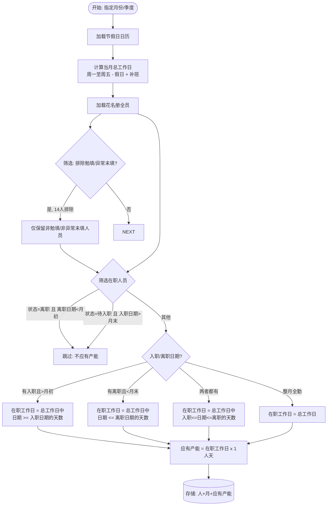

# 产能分析系统 v2 · 需求规格文档

> 文档编号: 20260717234000-产能分析系统需求 | 版本: v2.1 | 日期: 2026-07-18 | 状态: 已评审

---

## 一、概述

### 1.1 背景

v1 系统已实现基于工时明细 + 花名册的投入人天分析。当前盲区: 只有"实际填了多少"，不知道"应该填多少"。管理者无法回答:

- 本月团队应有多少产能? 实际填报了多少? 缺口在哪?
- 哪些人在职但长期零填报?
- 半年人力是否合理分配到各类项目(三快类/研发类/周期类)上?

### 1.2 目标

1. **产能填报审计**: 应有产能 vs 实际填报产能的对比分析，定位偏差与异常
2. **产能交叉维度分析**: 产能按时间(月/季/半年) x 项目三级分类(大类/分类/细分)为核心，交叉部门、角色、人员等多维度分析

### 1.3 数据资产

| 数据源 | 文件 | 规模 | 覆盖范围 |
|--------|------|------|----------|
| 工时明细 | `2026-01-01~2026-06-30工时明细.xlsx` | 27,769 条, 169 人, 59 项目 | 2026-01-04 ~ 2026-06-30 |
| 花名册 | `完整花名册_合并整理.xlsx` | 194 人 | 全量组织架构 + 角色 + 状态 |
| 项目分类 | `项目分类&项目清单.xlsx` | 30 个清单项目, 13 个细分分类 | 大类/分类/细分三级 |
| 节假日 | `企业节假日放假.xlsx` | 4 个假期 + 补班日期 | 影响工作日计算 |

**核心指标速览**:

| 指标 | 数值 |
|------|------|
| 总投入人天 | 16,533.2 |
| 填报人数 | 169 |
| 花名册人数 | 194 |
| 项目数 | 59(工时明细) / 30(清单项目) |
| 时间范围 | 2026-01-04 ~ 2026-06-30(6 个月) |

---

## 二、核心概念与口径

### 2.1 术语定义

| 术语 | 定义 |
|------|------|
| **人天** | 计量单位, 1 人天 = 1 人工作 1 天, 与原始 Excel 数据一致 |
| **应有产能** | 某人在统计期内按工作日计算的满额产能, 单位人天 |
| **实际产能** | 某人在统计期内实际填报的投入工时合计, 单位人天 |
| **填报率** | 实际产能 / 应有产能 x 100%, 反映填报完整度 |
| **工作日** | 周一至周五, 减去法定节假日, 加上调休补班 |
| **在职天数** | 统计期内实际在职的工作日天数 |
| **偏差** | 实际产能 - 应有产能(正 = 超填, 负 = 欠填) |
| **偏差率** | |偏差| / 应有产能 x 100% |
| **零填报人员** | 统计期内应有产能 > 0 但实际产能 = 0 的在职人员 |
| **勉填人员** | 花名册中"工时填报说明"标记为"勉填"的人员, 不纳入应有产能计算 |
| **异常未填人员** | 花名册中"工时填报说明"标记为"异常未填"的人员, 不纳入应有产能计算 |
| **项目分类** | 三级体系: 大类(三快类/研发类/周期类) -> 分类 -> 细分 |

### 2.2 应有产能计算公式

```
个人月度应有产能 = 当月在职工作日数 x 1 人天

其中:
- 当月总工作日 = 当月周一至周五 - 法定假日 + 调休补班
- 在职工作日 = 当月总工作日中, 满足 [入职日期, 离职日期] 范围内的天数
  (入职日期 <= 当日 AND (离职日期为空 OR 离职日期 >= 当日))
- 员工状态为"离职"且离职日期 < 月初 -> 当月不纳入(应有产能 = 0)
- 员工状态为"待入职"且入职日期 > 月末 -> 当月不纳入(应有产能 = 0)
- 花名册中"工时填报说明"为"勉填"或"异常未填"的人员 -> 不纳入应有产能计算(14人)
```

**季度应有产能 = 该季度 3 个月的月度应有产能之和。**
**半年度应有产能 = 6 个月的月度应有产能之和(当前数据 2026-01 ~ 2026-06)。**

**示例**: 员工 4 月 15 日入职, 4 月共 22 个工作日, 在职 12 个工作日 -> 4 月应有产能 = 12 人天。

### 2.3 偏差异常判定规则

| 条件 | 判定 | 标记 |
|------|------|------|
| |实际 - 应有| <= 3 人天 | 正常 | 无标记 |
| |实际 - 应有| > 3 人天 且 偏差率 <= 30% | 正常 | 无标记 |
| |实际 - 应有| > 3 人天 且 偏差率 > 30% | **异常** | 红色高亮 |
| 实际 = 0 且 应有 > 0 | **零填报** | 独立标记 |

注: 偏差方向(正/负)在展示时区分, 正偏差 = 超额填报, 负偏差 = 欠填。

### 2.4 数据对齐口径

| 维度 | 口径 |
|------|------|
| 统计粒度 | 按月 + 按季度 + 按半年 |
| 部门层级 | **以花名册部门层级为准**(一/二/三/四级), 工时明细中的"填报人部门"字段不作为部门分析依据 |
| 人员关联 | 优先**工号**匹配, 工号为空时按姓名去 `_sz`/`_SZ` 后缀匹配花名册 |
| 人员类型 | 不区分(在岗在编/在池/预入场一视同仁) |
| 员工状态 | 只看员工状态 + 入职/离职日期判断应有产能 |
| 勉填/异常未填 | 14 人(勉填 11 人 + 异常未填 3 人), **不纳入应有产能计算** |
| 项目分类 | **三级全保留**: 大类 -> 分类 -> 细分 |
| 重名处理 | 工号唯一标识(如陈鹏 × 2: 工号 11800343 境知产品部, 工号 12002565 流造产品部) |
| 未匹配项目 | 按"语义映射"匹配: 工时明细项目名去掉季度前缀(Q1/Q2/Q3/2025Q4 等)后与清单项目名匹配; 仍无法匹配的归入"未分类" |

### 2.5 人员匹配策略(详细)

工时明细中的填报人与花名册中的人员匹配, 存在以下特殊情况:

| 情况 | 人数 | 处理方式 |
|------|------|----------|
| 正常(姓名一致) | ~147 人 | 直接按姓名匹配 + 工号校验 |
| 外包 `_sz` 后缀 | 13 人 | 去掉 `_sz`/`_SZ` 后缀后按姓名匹配花名册 |
| 同名不同人(陈鹏) | 2 人 | 工时明细中"填报人部门"为"境知产品部"匹配工号 11800343, "智能体研发组"匹配工号 12002565 |
| 工号为空的外包 | 20 人 | 仅按姓名匹配(去掉 `_sz` 后缀) |
| 花名册有但工时无 | 38 人 | 含勉填/异常未填(14人)、离职、实习、外包(20人=工号为空的外包并非全部无填报) |

### 2.6 节假日与补班日历

| 假期 | 放假日期 | 放假天数 | 补班日期 | 补班说明 |
|------|----------|----------|----------|----------|
| 春节 | 2026-02-15 ~ 2026-02-24 | 10 | 2026-02-14(周六)、2026-03-01(周日) | 春节前后各补 1 天 |
| 清明 | 2026-04-04 ~ 2026-04-06 | 3 | 无 | — |
| 五一 | 2026-05-01 ~ 2026-05-05 | 5 | 2026-05-09(周六) | 补班 1 天 |
| 端午 | 2026-06-19 ~ 2026-06-21 | 3 | 无 | — |

**2026 年 1~6 月每月工作日数**(周一至周五 - 假日 + 补班):

| 月份 | 自然日 | 周一~周五 | 节假日扣除 | 补班增加 | **最终工作日** |
|------|--------|-----------|------------|----------|----------------|
| 1 月 | 31 | 22 | 0 | 0 | **22** |
| 2 月 | 28 | 20 | -5(春节 2/15~2/19 含工作日) | +1(2/14 补班) | **16** |
| 3 月 | 31 | 22 | 0 | +1(3/1 补班) | **23** |
| 4 月 | 30 | 22 | -1(清明 4/6 为周一) | 0 | **21** |
| 5 月 | 31 | 21 | -3(五一 5/1~5/5 含 3 个工作日) | +1(5/9 补班) | **19** |
| 6 月 | 30 | 22 | -1(端午 6/19 为周五) | 0 | **21** |

> 注: 春节 10 天跨越两个自然周, 其中含 5 个工作日(2/16 周一 ~ 2/20 周五)。2/15 周日和 2/21~2/24 也在假期中但不影响工作日计数。

### 2.7 项目分类体系

工时明细中 59 个项目 -> 通过"细分"列匹配到 13 个细分分类 -> 聚合到 6 个分类 -> 聚合到 3 个大类。

**分类映射表**(来自 `项目分类&项目清单.xlsx`):

| 大类 | 分类 | 细分 | 匹配项目数 |
|------|------|------|------------|
| **三快类** | 快服务 | 快服务迭代 | Q1/Q2 快服务项目 |
| | | 快服务子专项 | MK 缺陷清理专项 |
| | 快交付 | 快交付迭代 | Q1/Q2 快交付项目 |
| | | 快交付子专项 | 501&502 创新项目一期, MK 自动化测试五/六期 |
| | 快营销 | 快营销迭代 | Q1 快营销项目, Q2 快营销立项 |
| | | 快营销子专项 | (暂无匹配项目) |
| **研发类** | 创新专项 | 创新专项 | AI 中台、知识管理中台、KM 知识库、50X 组-创新项目、202 组(aiKM)、门户空间、知识治理、301 组、302 组项目 |
| | 发版专项 | 发版专项 | EKPV17.0.2.R 发版专项 |
| **周期类** | 配置组周期项目 | 配置组周期项目 | Q1/Q2 配置组周期性项目 |
| | 其他 | 日常运营&管理 | Q1/Q2 日常运营及管理 |
| | | 临时会议 | Q1/Q2 临时会议 |
| | | 请休假 | Q1/Q2 请休假 |
| | | 其他工作 | Q1/Q2 其他工作 |
| **未分类** | — | — | 工时明细项目名去季度前缀后仍无法匹配到清单的项目 |

---

## 三、核心业务流程

```mermaid
flowchart TD
    subgraph 数据准备
        A1[节假日日历<br/>4假期+3补班日] --> CALC
        A2[花名册<br/>194人/部门/角色/状态/入离职<br/>勉填14人不纳入] --> CALC
        CALC[应有产能计算引擎]
        CALC --> SHOULD[(应有产能<br/>按人+月)]
        A3[工时明细<br/>27,769条/169人<br/>姓名去_sz后缀匹配] --> ACTUAL[(实际产能<br/>按人+月+项目)]
        A4[项目分类<br/>13个细分->6个分类->3个大类] --> CATEGORY[(项目分类映射)]
    end

    subgraph 模块一: 产能填报审计
        SHOULD --> AUDIT[产能对比引擎]
        ACTUAL --> AUDIT
        AUDIT --> R1[填报率统计<br/>按部门/个人/月/季]
        AUDIT --> R2[偏差排行<br/>按部门/个人]
        AUDIT --> R3[异常判定<br/>|偏差|>3人天 & 偏差率>30%]
        AUDIT --> R4[零填报识别<br/>应有>0 且 实际=0<br/>排除勉填人员]
    end

    subgraph 模块二: 产能交叉维度分析
        ACTUAL --> CROSS[交叉分析引擎]
        CATEGORY --> CROSS
        SHOULD --> CROSS
        CROSS --> C5[时间维度<br/>月/季/半年 x 项目三层分类]
        CROSS --> C6[组织维度<br/>部门分布/下钻/填报率]
        CROSS --> C7[项目维度<br/>三级分类汇总/排名/集中度]
        CROSS --> C8[角色维度<br/>分布/交叉/人均产能]
        CROSS --> C9[人员维度<br/>排名/投入分布]
        CROSS --> C10[综合交叉<br/>部门x项目分类矩阵<br/>角色x项目分类x时间]
    end

    R1 & R2 & R3 & R4 & C5 & C6 & C7 & C8 & C9 & C10 --> DASHBOARD[前端看板]
```

### 应有产能计算流程



---

## 四、功能需求

### 模块一: 产能填报审计(独立页面)

#### F1.1 应有产能看板

**目的**: 展示各级组织理论上应有多少产能, 与实际对比。

| 需求编号 | 功能点 | 说明 |
|----------|--------|------|
| F1.1.1 | 全局应有产能汇总 | 展示全公司/选定部门的月度/季度/半年应有产能、实际产能、偏差 |
| F1.1.2 | 应有产能按月趋势 | 柱状图(应有) + 折线(实际), 双轴对比; 标注春节/五一等假期阴影区域 |
| F1.1.3 | 筛选条件 | 时间粒度(月/季/半年)、部门(支持二/三/四级下钻)、角色 |

**指标卡片**(顶部 KPI):

| 卡片 | 公式 | 说明 |
|------|------|------|
| 应有产能合计 | SUM(所有在职且非勉填人员应有产能) | 不含勉填 14 人 |
| 实际产能合计 | SUM(实际填报人天) | — |
| 整体填报率 | 实际 / 应有 x 100% | — |
| 偏差合计 | 实际 - 应有 | 正值 = 超填, 负值 = 欠填 |

#### F1.2 填报率分析

| 需求编号 | 功能点 | 说明 |
|----------|--------|------|
| F1.2.1 | 部门填报率排行 | 表格: 部门名称、应有产能、实际产能、偏差、填报率、异常人数 |
| F1.2.2 | 填报率趋势 | 折线图: 各月填报率变化趋势 |
| F1.2.3 | 部门填报率下钻 | 从二级部门下钻到三级/四级 |
| F1.2.4 | 低填报率预警 | 填报率 < 80% 的部门/人员自动高亮 |

#### F1.3 零填报人员识别

| 需求编号 | 功能点 | 说明 |
|----------|--------|------|
| F1.3.1 | 零填报名单 | 列表: 姓名、工号、部门、角色、应有产能、入职日期 |
| F1.3.2 | 零填报按部门分布 | 各二级部门零填报人数统计 |
| F1.3.3 | 排除规则 | 自动排除勉填/异常未填人员(14人)、当月入职/离职人员(首尾月合理) |

#### F1.4 偏差异常排行

| 需求编号 | 功能点 | 说明 |
|----------|--------|------|
| F1.4.1 | 个人偏差排行 | 表格: 姓名、部门、角色、应有产能、实际产能、偏差、偏差率、异常标记 |
| F1.4.2 | 部门偏差汇总 | 表格: 部门、总应有、总实际、总偏差、偏差率、异常人数占比 |
| F1.4.3 | 异常标红 | 满足"绝对偏差 > 3 人天 且 偏差率 > 30%"自动红色标记 |
| F1.4.4 | 排序切换 | 支持按偏差绝对值、偏差率、应有产能等列排序 |
| F1.4.5 | 超额/欠填筛选 | 支持只看正向偏差(超填)或负向偏差(欠填) |

#### F1.5 异常人员明细

| 需求编号 | 功能点 | 说明 |
|----------|--------|------|
| F1.5.1 | 异常人员列表 | 集中展示所有被标红的人员 |
| F1.5.2 | 异常原因推断 | 展示该人员的项目分布, 帮助判断"兼项过多"还是"填报缺失" |
| F1.5.3 | 月度明细 | 点击某人展开月度应有 vs 实际对比柱状图 |
| F1.5.4 | 导出留档 | [P2] 导出异常人员列表为 Excel |

---

### 模块二: 产能交叉维度分析

**核心分析框架**: 以**时间(月/季/半年) x 项目三级分类**为骨架, 交叉部门、角色、人员等多维度。

#### F2.1 时间 x 项目分类

**目的**: 看半年/Q1/Q2/月度下, 各项目分类的产能分布与趋势。

当前数据 6 个月(2026-01 ~ 2026-06), Q1 = 1~3 月(人天 7,969.9), Q2 = 4~6 月(人天 8,563.3)。

> 注: Q3 无数据(仅 Q3 预立项项目名出现在明细中, 日期仍在 Q2 范围内, 归入未分类)。

| 需求编号 | 功能点 | 说明 |
|----------|--------|------|
| F2.1.1 | 半年产能分类汇总 | 饼图/环形图: 2026H1 总人天按大类(三快类/研发类/周期类)占比 |
| F2.1.2 | Q1/Q2 季度产能分类对比 | 堆叠柱状图: Q1 vs Q2 各分类人天对比 |
| F2.1.3 | 月度产能分类趋势 | 折线图: 各分类 1~6 月人天趋势(可切换大类/分类/细分三层) |
| F2.1.4 | 分类下钻 | 大类 -> 分类 -> 细分, 逐层展开, 每层展示人天 + 占比 + 项目数 |
| F2.1.5 | 应有 vs 实际(按时间) | 每月应有产能 vs 实际产能对比, 标注偏差 |

#### F2.2 组织 x 项目分类

**目的**: 各部门在不同项目分类上的投入分布。

| 需求编号 | 功能点 | 说明 |
|----------|--------|------|
| F2.2.1 | 部门产能分布 | 堆叠柱状图: 各二级部门在三大类(三快/研发/周期)上的人天 |
| F2.2.2 | 部门分类偏好 | 热力图或表格: 行=部门, 列=分类, 值=人天 |
| F2.2.3 | 部门填报率 | 表格: 各二级部门填报率, 支持下钻到三/四级 |
| F2.2.4 | 组织下钻 | 二级 -> 三级 -> 四级, 每层展示分类人天分布 |

#### F2.3 角色 x 项目分类

**目的**: 不同角色在各项目分类上的产能投入。

| 需求编号 | 功能点 | 说明 |
|----------|--------|------|
| F2.3.1 | 角色分类分布 | 堆叠柱状图: 各角色在三大类上的人天 |
| F2.3.2 | 角色 x 分类交叉表 | 表格: 行=角色, 列=分类(或细分), 值=人天 |
| F2.3.3 | 角色人均产能 | 柱状图: 各角色人均人天对比 |
| F2.3.4 | 角色 x 分类 x 时间 | 折线图: 选中某角色, 展示其每月在各类项目上的投入趋势 |

#### F2.4 人员维度

| 需求编号 | 功能点 | 说明 |
|----------|--------|------|
| F2.4.1 | 个人产能排名 | 表格: 按实际人天降序, 展示部门/角色/应有/实际/偏差 |
| F2.4.2 | 个人投入分布 | 点击某人展示其项目分类饼图 + 月度趋势 |
| F2.4.3 | 个人应有 vs 实际 | 选中某人展示月度应有 vs 实际柱状图 |

#### F2.5 综合交叉

| 需求编号 | 功能点 | 说明 |
|----------|--------|------|
| F2.5.1 | 部门 x 分类矩阵 | 交叉表: 行=部门, 列=项目分类, 值=人天汇总 |
| F2.5.2 | 角色 x 分类 x 时间 | 热力图: 横轴=月份, 纵轴=角色, 值=某大类人天 |
| F2.5.3 | 三快计划 vs 实际对比 | Q1/Q2 快服务/快交付/快营销 计划值 vs 实际值柱状+达成率 |

---

## 五、非功能需求

### 5.1 性能

| 需求 | 标准 |
|------|------|
| 页面首次加载 | < 3 秒(含 API 请求) |
| 筛选切换响应 | < 1 秒(数据量 ~28K 条) |
| 应有产能计算 | 194 人 x 6 个月, 计算时间 < 2 秒 |
| 图表渲染 | ECharts 渲染 < 500ms |

### 5.2 数据准确性

| 需求 | 标准 |
|------|------|
| 应有产能计算 | 与手动 Excel 核算结果偏差 < 1 人天 |
| 部门聚合 | 以花名册层级为准, 部门汇总 = 下属人员之和 |
| 填报率精度 | 保留 2 位小数(如 87.35%) |
| 人员匹配 | 194 花名册 vs 169 填报人完全匹配, 不得漏匹配 |

### 5.3 约束

| 约束 | 说明 |
|------|------|
| 不预置鉴权 | 遵循母版规则, 单用户/信任环境 |
| 不连外部系统 | 数据完全来自本地 Excel 导入 |
| 全量替换导入 | 每次导入清空旧数据, 前端数据管理页手动上传刷新 |
| 不区分人员类型 | 在岗在编/在池/预入场统一计算 |
| 勉填/异常未填排除 | 14 人(勉填 11 + 异常未填 3)不纳入应有产能 |

---

## 六、验收标准(Done 定义)

### 6.1 数据准备

- [ ] **AC1** 节假日日历正确导入, 含 4 个假期 + 3 个补班日, 工作日计算正确
- [ ] **AC2** 花名册与工时明细**工号匹配**(工号为空则去 `_sz` 后缀按姓名匹配), 两个陈鹏按工号+部门区分
- [ ] **AC3** 项目三级分类正确导入: 13 个细分 -> 6 个分类 -> 3 个大类; 工时明细项目按"去季度前缀"语义匹配清单, 仍无法匹配的归入"未分类"
- [ ] **AC4** 应有产能按月计算, 含中途入离职折算、在职状态过滤、**勉填/异常未填 14 人排除**
- [ ] **AC5** 外包 13 人(工时明细中含 `_sz` 后缀)正确匹配到花名册
- [ ] **AC6** 前端数据管理页支持手动上传 5 份 Excel 刷新全部数据, 导入结果展示各类行数/匹配率/未匹配清单

### 6.2 模块一: 产能填报审计

- [ ] **AC6** 全局/按部门的应有产能 vs 实际产能对比看板可正确展示
- [ ] **AC7** 部门填报率排行正确, 下钻到三/四级部门数据一致
- [ ] **AC8** 零填报人员列表完整, 不含勉填/异常未填/已离职/待入职未到日期的员工
- [ ] **AC9** 偏差 > 3 人天且偏差率 > 30% 的记录正确标红
- [ ] **AC10** 支持按月、按季度、按部门筛选

### 6.3 模块二: 产能交叉维度分析

- [ ] **AC11** 半年/Q1/Q2/月度产能按项目三大类(三快/研发/周期)汇总正确
- [ ] **AC12** 分类下钻(大类->分类->细分)数据一致, 各层人天合计 = 总人天
- [ ] **AC13** 部门 x 项目分类矩阵数据正确, 部门合计 = 花名册层级汇总
- [ ] **AC14** 角色 x 项目分类交叉数据正确
- [ ] **AC15** 三快计划 vs 实际对比: Q1/Q2 快服务/快交付/快营销 计划值 vs 实际值 + 达成率
- [ ] **AC16** 应有 vs 实际产能趋势按月/季正确展示

### 6.4 质量闸门

- [ ] **AC17** 后端 `Ruff + mypy(strict) + pytest` 全部通过, 覆盖率 >= 80%
- [ ] **AC18** 前端 `Biome + tsc + Vitest` 全部通过
- [ ] **AC19** 应有产能计算有独立单元测试(含: 全勤/中途入职/中途离职/跨月/假期扣除/补班/勉填排除)
- [ ] **AC20** `pnpm check` 全绿

---

## 七、边界与非目标(YAGNI)

| 不做 / 推迟 | 原因 |
|-------------|------|
| 实时数据同步 | 数据源为离线 Excel, 前端数据管理页手动上传刷新 |
| 预算 vs 实际对比 | 花名册"计划投入项目"为自由文本, 不纳入 |
| 产能预测/趋势预测 | 半年数据不满足预测模型最低要求 |
| 鉴权/登录/权限 | 母版不预置鉴权 |
| 移动端适配 | 桌面优先 |
| 同比分析 | 仅半年数据, 无去年同期 |
| 人员类型区分 | 已决策: 不区分, 统一计算 |
| 异常人员 Excel 导出 | P2, 先做页面展示 |

---

## 八、已确认决策汇总

| # | 问题 | 结论 |
|---|------|------|
| Q1 | 补班日期 | 已确认: 2/14(补春节)、3/1(补春节)、5/9(补五一) |
| Q2 | 项目分类层级 | 三级全保留: 三快类/研发类/周期类 -> 6 分类 -> 13 细分, 未匹配 31 个项目入"未分类" |
| Q3 | 季度应有产能 | 季度 = 各月度之和, 与月度折算逻辑一致 |
| Q4 | 部门数据 | 统一以花名册为准, 工时明细的"填报人部门"不做分析依据; 两个陈鹏用工号区分; 外包 13 人去 `_sz` 匹配 |
| Q5 | 细分层 | 需要到第三层(细分), 表结构预留 |
| Q6 | 审计页面 | 独立页面, 不整合到现有模块 |
| — | 勉填/异常未填 | 14 人不纳入应有产能计算 |

---

*文档版本 v2.1, 已评审, 可移交架构师做技术方案。*
