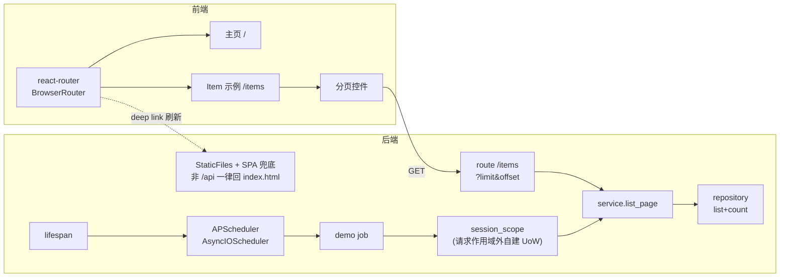
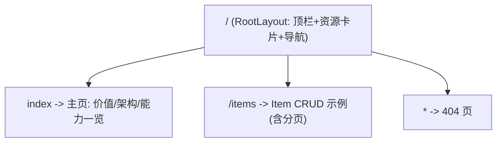
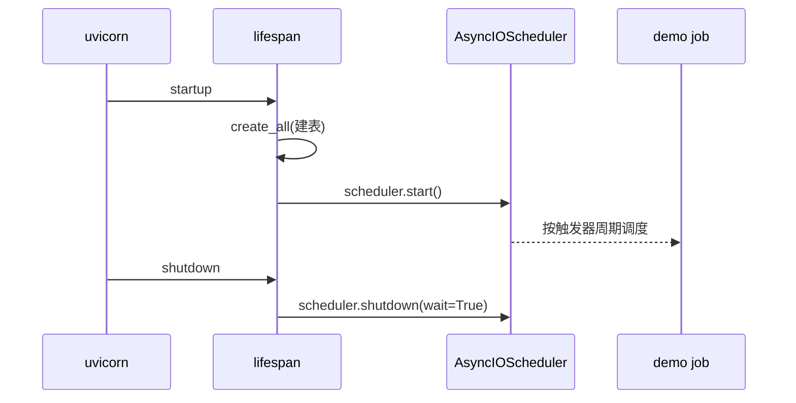
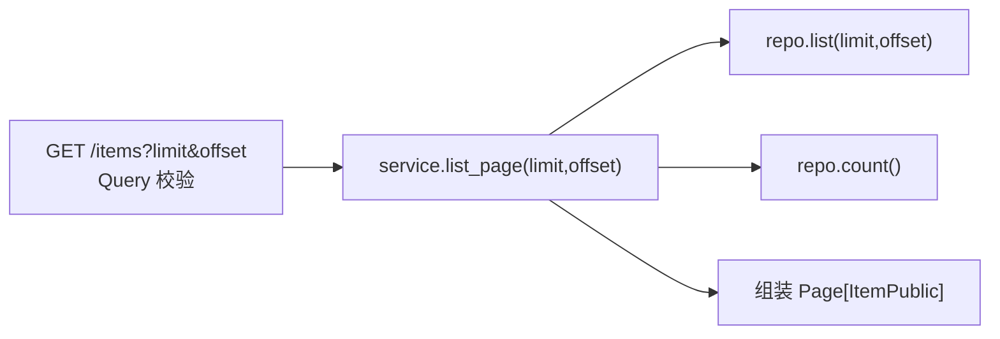

# 基座能力改造方案:前端路由 + 定时任务 + 列表分页

> 状态:待评审 / 未开工。给母版补三项"任何 web 业务几乎必用"的地基能力,全部走**最小正确示范**,不碰业务横切,守住四条硬约束(只用 GET/POST、完整三层、同源单进程、质量三闸门)。

## 0. 目标(Done 定义)

| 能力 | 完成标准 |
|---|---|
| 前端路由 | 多页 SPA 骨架(react-router);**生产同源部署后,深链刷新(如 `/items`)不 404** |
| 定时任务 | in-process 调度器随应用 `lifespan` 起停;有一个走**服务层**的 demo job;单 worker 下唯一执行 |
| 列表分页 | `GET /items?limit&offset` 返回分页信封;三层贯通;前端有翻页;契约变更前后端同步 |
| 全局 | `pnpm check` 全绿,后端覆盖率仍 >= 80%,不违反任一硬约束 |

## 1. 现状与缺口(已核实)

- 前端:纯单页(`App.tsx` 直挂),**无 react-router**。
- 后端:仅 `main.py` 的 `lifespan` 建表,**无任何 scheduler/cron**。
- 列表:`GET /items` 全量返回(`item_service.list()` 无 `limit/offset`),**无分页**。
- 已就绪、本次复用:三层骨架、`get_session`(请求级 UoW)、`ItemRepository/ItemService`、Alembic 已接好、质量闸门。

## 2. 改动全景



## 3. 硬约束校验(方案必须守)

- **只用 GET/POST**:分页用 GET query 参数(合规);调度器不走 HTTP;路由是客户端行为。全程无 PATCH/PUT/DELETE。[PASS]
- **完整三层**:分页贯通 route->service->repository;定时 job **不得**直接碰 SQL,必须经 service(见 5.3)。[PASS]
- **同源单进程**:调度器 in-process(不另起 worker);路由靠后端 SPA 兜底(见 4.4)。[PASS]
- **质量闸门**:新增依赖走 mypy override;三项各配测试,覆盖率守住 80%。[PASS]

---

## 4. 方案 A:前端路由

### 4.1 选型
`react-router-dom` v7,**声明式 / library 模式**(`BrowserRouter` + `Routes/Route`)。不上 framework/data 模式(那是 Remix 化,YAGNI)。

### 4.2 目标路由表



### 4.3 文件改动
```
apps/web/src/
├── main.tsx                 # 包 <BrowserRouter>
├── router.tsx              # (新) 路由表
├── layouts/RootLayout.tsx  # (新) 顶栏 + 资源卡片 + 导航 + <Outlet/>
├── pages/
│   ├── HomePage.tsx        # (新) 现 Hero+ArchFlow+CapabilityGrid 迁入
│   └── ItemsPage.tsx       # (新) 现 ItemsPanel 迁入 + 分页
└── App.tsx                 # 瘦身或删除(职责拆到 layout/pages)
```

### 4.4 关键集成点:同源单进程的 SPA 兜底(最容易踩的坑)
生产是 uvicorn 托管 `static/`。客户端路由下,用户在 `/items` **刷新**会直接打后端,若无兜底就 404。方案:在 `main.py` 所有 API 路由**之后**加 catch-all,非 `/api` 前缀一律回 `index.html`:

```python
# main.py, 挂在 api_router 之后
from fastapi.responses import FileResponse

@app.get("/{full_path:path}")  # SPA 兜底: 深链刷新回 index.html
async def spa_fallback(full_path: str) -> FileResponse:
    return FileResponse(static_dir / "index.html")
```
- 顺序要紧:必须在 `include_router(api_router)` 之后注册,`/api/*` 才不会被兜底吞掉。
- 静态资源仍由 `StaticFiles` 命中;只有"既非 API 又非真实文件"的路径落到兜底。
- 开发态(vite)自带 SPA fallback,无需改。

### 4.5 验收
- `pnpm dev` 下 `/` 与 `/items` 正常切换,导航高亮。
- `pnpm build && pnpm start` 后,浏览器直接访问 `http://host/items` 刷新**不 404**。
- 加一条 smoke 测试:渲染路由、断言主页与 items 页各自关键元素。

---

## 5. 方案 B:定时任务

### 5.1 选型
`APScheduler` 的 `AsyncIOScheduler`(async 原生,复用 FastAPI 事件循环,零额外进程)。新增依赖 `apscheduler`;mypy 缺存根则加 override(同 psutil 处理)。

### 5.2 生命周期



### 5.3 层次纪律(核心设计点)
Job 运行在**请求作用域之外**,拿不到 `Depends(get_session)`。但**禁止**在 job 里直接写 SQL —— 必须经 service。做法:在 `db/session.py` 抽一个**独立 UoW** 上下文,让 job 自建 session 再走 service:

```python
# db/session.py: 复用同一 engine, 抽出可在任意上下文用的会话作用域
from contextlib import asynccontextmanager

@asynccontextmanager
async def session_scope() -> AsyncGenerator[AsyncSession, None]:
    async with _session_maker() as session:   # _session_maker 与 get_session 共用
        try:
            yield session
            await session.commit()
        except Exception:
            await session.rollback()
            raise
```

```python
# core/scheduler.py (新)
from apscheduler.schedulers.asyncio import AsyncIOScheduler
from app.db.session import session_scope
from app.repositories.item_repository import ItemRepository
from app.services.item_service import ItemService

scheduler = AsyncIOScheduler()

async def _log_item_count() -> None:               # demo job: 经 service, 不碰 SQL
    async with session_scope() as session:
        service = ItemService(ItemRepository(session))
        items = await service.list()               # 分页落地后改 list_page
        logger.info("scheduled.item_count", count=len(items))

def register_jobs() -> None:
    scheduler.add_job(_log_item_count, "interval", seconds=60, id="log_item_count",
                      replace_existing=True, max_instances=1, coalesce=True)
```

```python
# main.py lifespan 内
register_jobs(); scheduler.start()
try:
    yield
finally:
    scheduler.shutdown(wait=False)
```

### 5.4 坑:多实例重复执行
in-process 调度在**每个进程/worker** 各跑一份 -> 多 worker/多副本会重复触发。母版是**单 worker**(`start.mjs` 未开 `--workers`),当前无碍。文档明确:上多副本时,二选一 —— APScheduler 配持久 jobstore + 分布式锁,或改用外部调度器(系统 cron / K8s CronJob 打一个内部 GET)。**不在母版内预置**(YAGNI),仅在此备注。

### 5.5 验收
- 起服务后日志按 60s 出现 `scheduled.item_count`;关服务调度器干净退出(无告警)。
- 单测:直接 `await _log_item_count()`(用测试会话覆盖 `session_scope` 或内存库),断言不抛异常、计数正确。

---

## 6. 方案 C:列表分页

### 6.1 契约(破坏性变更)
`GET /items` 由"返回 `list[ItemPublic]`" 改为**分页信封**:

```
GET /api/v1/items?limit=20&offset=0
->
{ "items": [ItemPublic...], "total": 128, "limit": 20, "offset": 0 }
```
- `limit`:默认 20,`Query(ge=1, le=100)`;`offset`:默认 0,`Query(ge=0)`。仍是 GET。
- 复用型分页模型(给团队后续实体照抄):

```python
# models/pagination.py (新)
from typing import Generic, TypeVar
from sqlmodel import SQLModel
T = TypeVar("T")
class Page(SQLModel, Generic[T]):
    items: list[T]
    total: int
    limit: int
    offset: int
```

### 6.2 三层改动



- `repository`:`list(limit, offset)` 加 `.limit().offset()`;新增 `count()`(`select(func.count())`)。
- `service`:`list_page(limit, offset) -> Page[Item]`(取 items + total)。
- `route`:`list_items(limit=Query(20,ge=1,le=100), offset=Query(0,ge=0))`,`response_model=Page[ItemPublic]`。

### 6.3 前端适配(契约变了,必须改)
- `api/client.ts`:`Item[]` -> `Page<Item>`;`list({limit, offset})`。
- `hooks/useItems.ts`:`useItems(page)`,`queryKey: ["items", limit, offset]`;`placeholderData: keepPreviousData` 避免翻页闪烁。
- `ItemsPage`(原 ItemsPanel):`list.data.items.map(...)`;底部加 **上一页/下一页 + `total` 计数**;`QuantityChart` 传 `items`(仅当前页)。

### 6.4 验收
- `GET /items?limit=2&offset=0` 与 `offset=2` 返回不同页、`total` 一致。
- 边界:`limit=0`/`limit=101` 返回 422;空库返回 `items:[], total:0`。
- 前端翻页、计数正确,`pnpm check:web` 绿。

---

## 7. 任务拆解(P0/P1/P2 + 依赖 + 耗时)

| # | 任务 | 优先级 | 依赖 | 预估 | 可并行 |
|---|---|---|---|---|---|
| C1 | 后端分页:repo `count`/`list(limit,offset)` + `Page` 模型 + service + route | P0 | - | 1h | 与 A、B 并行 |
| C2 | 后端分页测试(边界 + 分页正确性) | P0 | C1 | 0.5h | |
| A1 | 前端路由骨架:router + RootLayout + pages 迁移 + SPA 兜底(main.py) | P0 | - | 2h | 与 B、C 并行 |
| A2 | 路由 smoke 测试 + 深链刷新验证 | P1 | A1 | 0.5h | |
| C3 | 前端分页适配:client/hook/ItemsPage 翻页 UI | P0 | C1、A1 | 1.5h | A1 后 |
| B1 | 调度器:`session_scope` 抽取 + `core/scheduler.py` + lifespan 起停 + demo job | P1 | - | 1.5h | 与 A、C 并行 |
| B2 | 调度器测试 + mypy override | P1 | B1 | 0.5h | |
| Z | 收尾:`pnpm check` 全绿 + 更新 README(能力清单+路由说明)+ docs 留档 | P0 | 全部 | 1h | 最后 |

关键路径:`A1 -> C3`(分页 UI 挂在 items 页上)。B 全程独立可并行。总量约 1 人日出头。

## 8. 风险与坑(逐条已给缓解)

- **SPA 深链 404**:catch-all 必须在 API 路由**之后**;且不能吞 `/api`(见 4.4)。
- **调度多实例重复**:母版单 worker 无碍,多副本需锁/外部调度(见 5.4),仅备注不预置。
- **分页破坏前端**:`list` 契约从数组变信封,前端不改会白屏 —— C1 与 C3 必须成对交付。
- **job 越层**:严禁 job 内直接 SQL,一律 `session_scope` + service(见 5.3)。
- **覆盖率**:新增 route/service/scheduler 需配套测试,否则跌破 80% 闸门。

## 9. 依赖与版本(以安装时最新稳定为准)

- 后端:`apscheduler`(AsyncIOScheduler,3.x 稳定);mypy 缺存根加 `[[tool.mypy.overrides]] module=["apscheduler.*"] ignore_missing_imports=true`。
- 前端:`react-router-dom`(v7,library 模式)。

## 10. 测试计划

- 后端:分页(边界 + 正确性)、调度 job(直接 await,内存库);沿用 `client`/`session` 夹具。
- 前端:路由渲染 smoke;分页翻页交互(Vitest + Testing Library)。
- 端到端(可选,test-engineer):`/items` 深链刷新 + 翻页闭环(Playwright)。

## 11. 总验收清单

- [ ] `/` 与 `/items` 路由可切换,导航高亮
- [ ] `pnpm build && pnpm start` 后 `/items` 刷新不 404
- [ ] 调度 demo job 按周期跑、随应用干净起停
- [ ] `GET /items?limit&offset` 返回分页信封,边界 422 正确
- [ ] 前端翻页可用、`total` 正确
- [ ] `pnpm check` 全绿,后端覆盖率 >= 80%
- [ ] README 能力清单更新;本方案随实现落 `docs/`

---

> 备注:若走 Agent 流水线实现,按 `docs/README.md` 约定各角色产出到 `docs/<时间戳-任务>/{需求,架构,前端,后端,测试}/`;简单起见也可主会话直接按本方案 P0->P1 推进。
