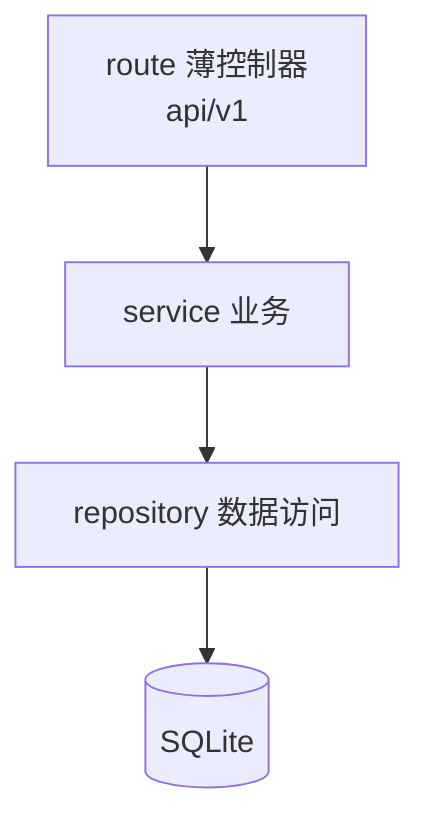
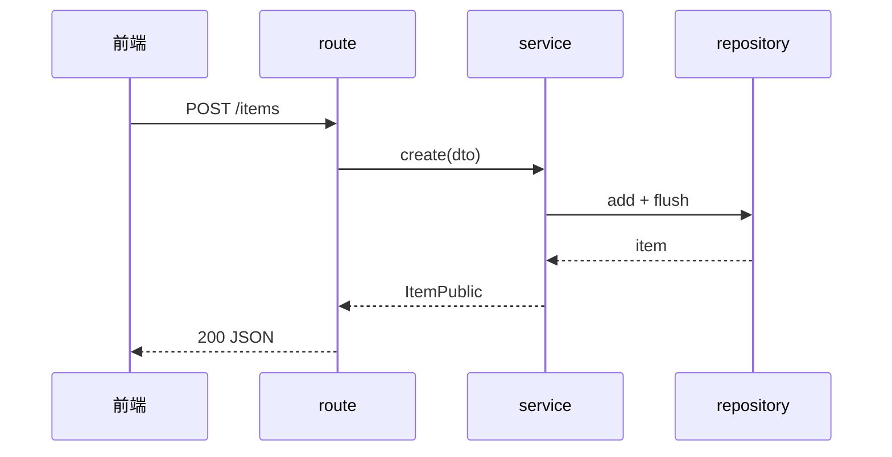
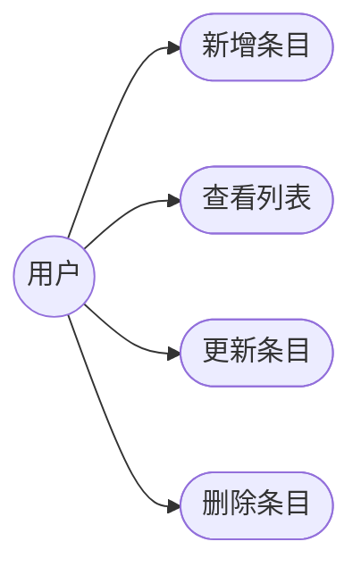

# docs/ 文档归集约定

本目录收集**任务级**交付文档。目标: 每个成规模的任务都留下可追溯的需求 / 架构 / 实现 / 测试记录, 且**一图胜千言**——尽量用图表达结构与流程, 而不是堆文字。

> 琐碎改动(改个字段、修个小 bug)可以不写; 但凡走了 `需求 -> 架构 -> [后端 / 前端] -> 测试` 这套 Agent 流水线, 或工作成规模, 就必须留档并尽量配图。

## 目录结构

每个任务一个目录, 目录名 = `日期-任务名`, 其下按角色分五个子目录:

```
docs/
└── 20260716143022-原型任务/          # 日期到秒 YYYYMMDDHHMMSS - 任务名(业务语义, 中文或 kebab 均可)
    ├── 需求/                   # requirements-analyst 产出
    ├── 架构/                   # architect 产出(必配图: 架构图 / 流程图 / 用例图)
    ├── 前端/                   # frontend-engineer 产出
    ├── 后端/                   # backend-engineer 产出
    └── 测试/                   # test-engineer 产出
```

## 命名与目录规则

- **任务目录名**: `YYYYMMDDHHMMSS-任务名`(**到秒**, 如 `20260716143022-原型任务`)。到秒既避免同日撞名, 又天然按时间排序。
- **谁来建**: 由启动流水线的一方(通常是主会话, 有 Bash)用 `date +%Y%m%d%H%M%S` 生成一次并建目录, 把目录名传给各 Agent; 后续 Agent **复用同一目录**, 只写自己的子目录, 不各自造名。单独调用某个 Agent 时, 复用当天最新任务目录或(有 Bash 时)自行新建。
- **取时间戳**: 用 `date +%Y%m%d%H%M%S` 一次生成到秒; 无 Bash 的 Agent(需求 / 架构)不自行造名, 直接写入给定的任务目录。
- **文档文件名**: 子目录内用业务语义即可, 如 `需求规格.md`、`接口契约.md`、`架构图.md`、`测试策略.md`。

## 谁产出什么

| 子目录 | 负责 Agent | 主要内容 |
|--------|-----------|----------|
| 需求/ | requirements-analyst | 背景与问题、用户故事 / 场景、验收标准(Done)、边界与非目标、开放问题 |
| 架构/ | architect | 架构草案 + 接口契约 + 任务清单(P0/P1/P2 + 依赖 + 耗时) + 关键决策; **架构图 / 流程图 / 用例图** |
| 后端/ | backend-engineer | 分层落地说明、接口实现、关键取舍; 复杂流程配时序图 / 流程图 |
| 前端/ | frontend-engineer | 页面 / 组件 / 状态设计、交互流程; 配组件结构图 / 交互流程图 |
| 测试/ | test-engineer | 测试策略、用例清单、覆盖率结论、E2E 关键旅程; 配测试流程图 / 用例图 |

## 图统一用 Mermaid

选 Mermaid 的理由: 纯文本、可 diff、GitHub 直接渲染, 不引二进制图片、不需额外工具。下面是三类图的最小模板, 复制改造即可。

### 架构图(分层 / 模块)



### 流程图 / 时序图



### 用例图(Mermaid 无原生类型, 用 flowchart 近似: 参与者 -> 用例)



> 需要严格 UML 用例图时可改用 PlantUML(`@startuml` / `usecase`), 但要额外渲染; 母版默认优先 Mermaid。

## 与 Agent 记忆(agent-memory)的区别

两套持久化,别混:

- **任务文档**(本目录 `docs/<任务>/<角色>/`):单次任务的**交付物**, 给人看、随任务归档, "这次做了什么"。
- **Agent 记忆**(`.claude/agent-memory/<agent>/`, 各 subagent 已开 `memory: project`):该 Agent **跨任务**积累的复用知识(套路 / 踩坑 / 决策), 启动时自动载入其上下文, "以后怎么少踩坑"。随仓库共享, fork 团队用得越久越聪明。

